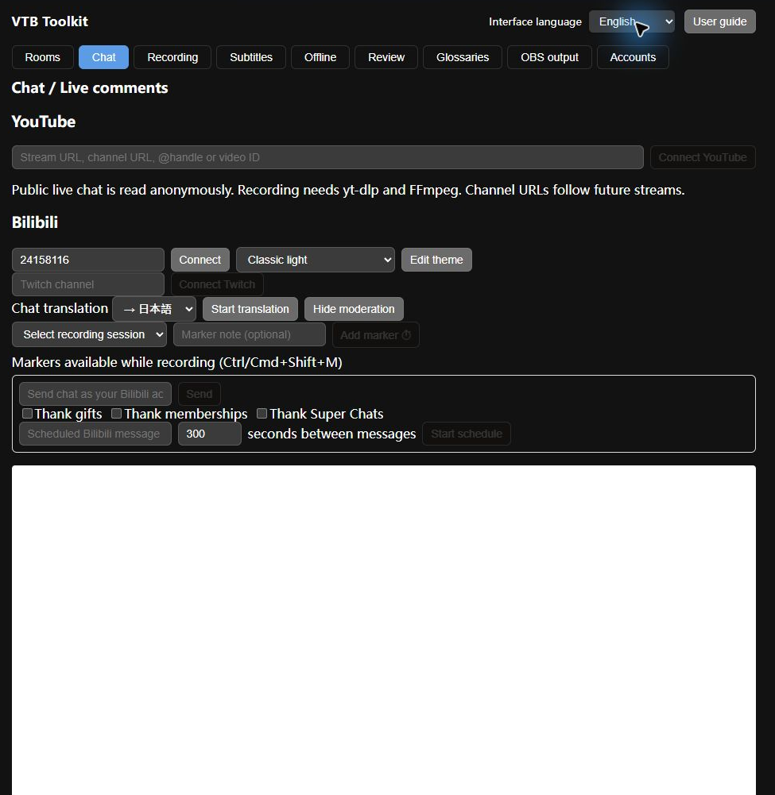
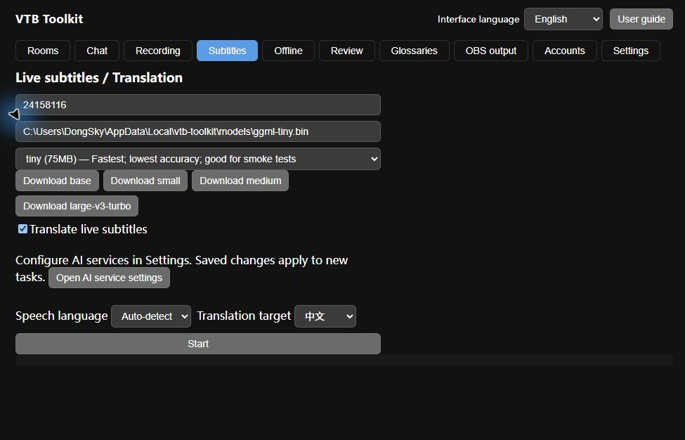
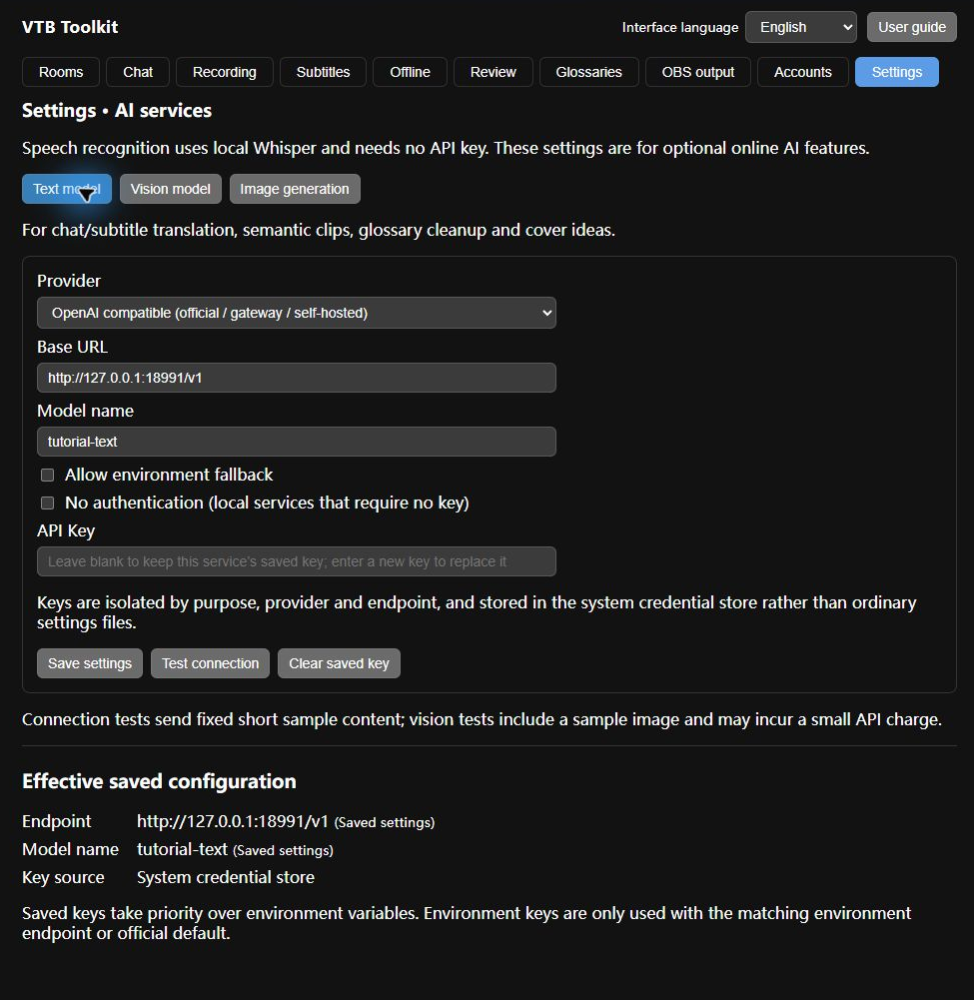
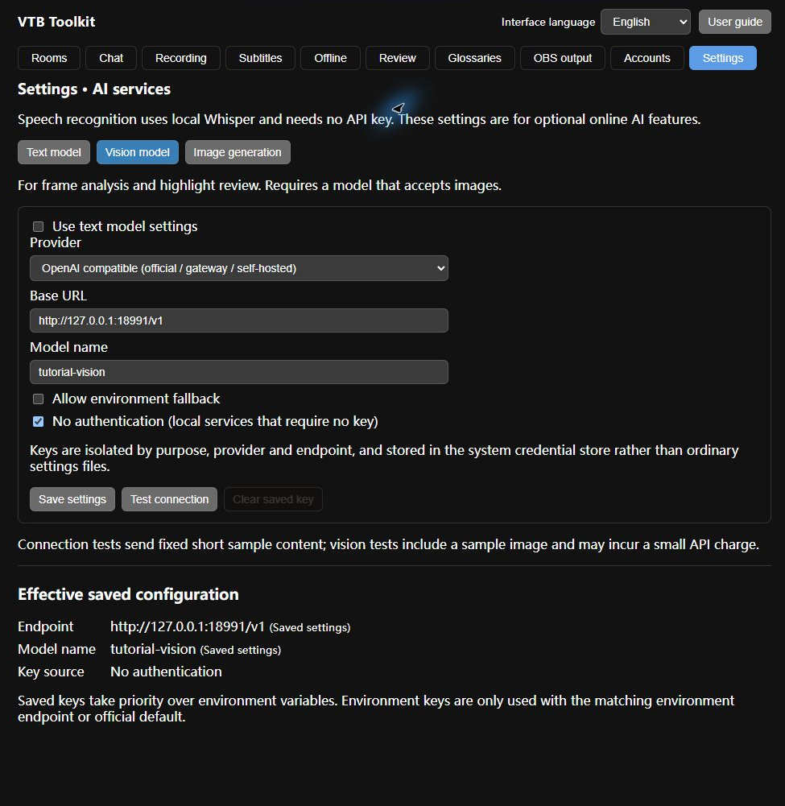
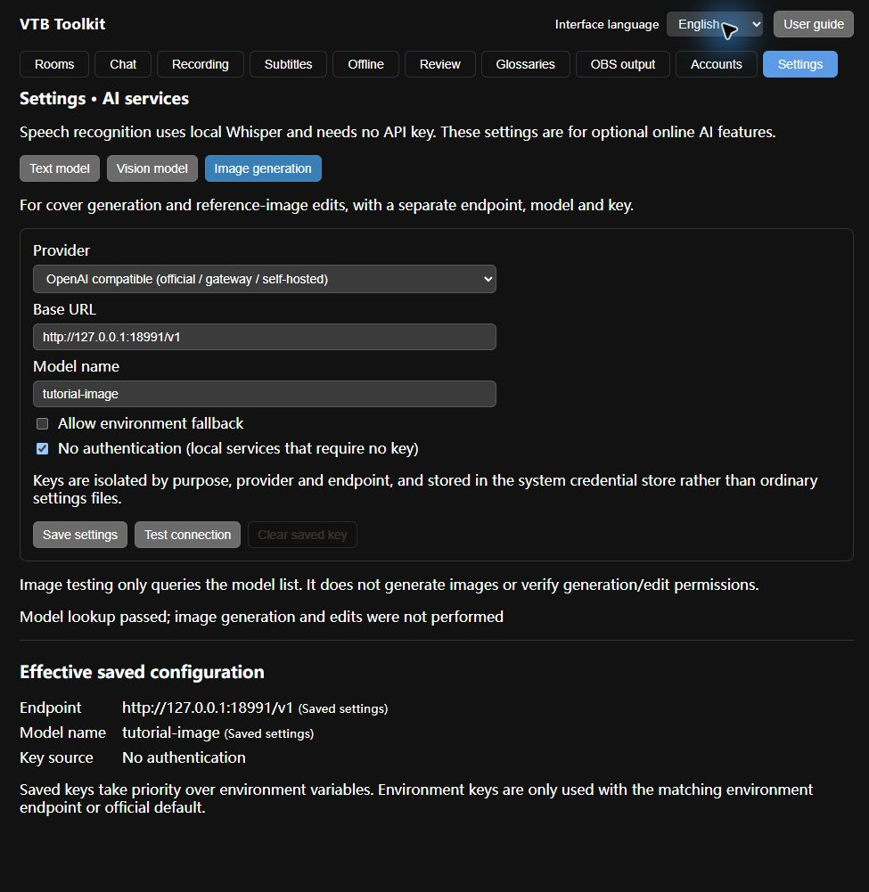
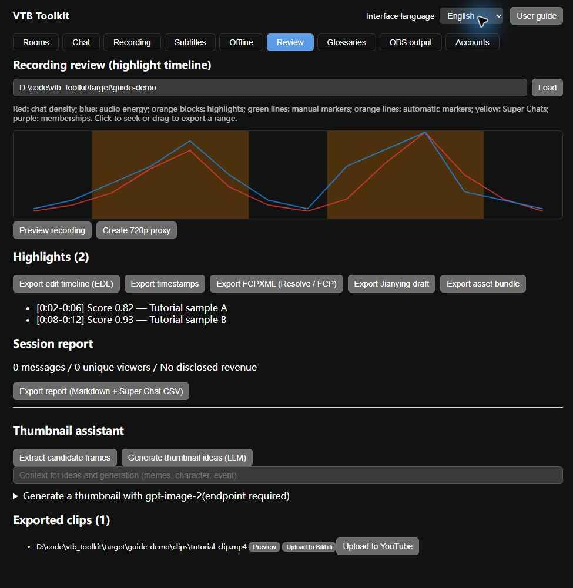

# VTB Toolkit User Guide

An offline guide from live streams to finished clips

For streamers, moderators, recorders and clip creators. Click screenshots to enlarge; switch languages or print to PDF at the top.

Version 0.1.0 · Updated 2026-09-13

## Getting started and interface language

1. Launch the Windows installation or vtb-toolkit.exe. The top bar provides language selection, this guide and ten feature tabs. Choose 简体中文, English or 日本語; the change is immediate and remembered after restart.

2. Interface language is separate from speech recognition and translation targets. Viewer names, chat, notes and authored upload fields remain unchanged. Switching language does not restart tasks on the current page.

3. Recording, frame extraction and clipping require FFmpeg/ffprobe. YouTube/Twitch stream resolution requires yt-dlp. Add these to PATH; Windows can also find yt-dlp beside the executable. Download a Whisper model in Subtitles and configure your own endpoint for text AI.

4. Suggested flow: choose an output folder and save streams → connect chat and record → add markers, live subtitles and OBS → process the recording offline → review, create covers, export and upload.

Actual Windows interface · Click to enlarge (zh-CN)

## Rooms and both platforms

1. Bilibili: add the numeric room ID in Rooms. Cards show the cover, creator, category and live/replay/offline status, refreshed every 30 seconds. Connect chat, start/stop recording or remove a favorite from its card.

2. YouTube: enter a public live URL, video ID, @handle or channel URL. A fixed video identifies one broadcast; a channel favorite can discover new broadcasts. Connect its chat, and set the output folder in Recording before starting a recording.

3. YouTube chat uses anonymous reading without an API key or Google sign-in. Members-only, age/region-restricted, offline or chat-disabled streams may be unavailable. Reading relies on YouTube web interfaces, so website changes may require an app update.

Actual Windows interface · Click to enlarge (en)

## Chat, translation and viewer notes

1. In Chat, connect Bilibili rooms, manage YouTube favorites or use the Twitch field for anonymous channel chat. The list displays messages, gifts, Super Chats, stickers and membership events, including emoji, avatars and platform badges.

2. Choose a translation target (Chinese, English, Japanese or Korean) and enable translation. First save the text model configuration in Settings → AI services. Translations appear both in the app and the OBS chat overlay. Interface language does not change this target.

3. Click a username to add a viewer note; an empty note clears its tag. Notes are stored by platform identity to avoid confusing identical names. Localization leaves names, chat and notes intact. Anonymous Bilibili chat may mask names; sign-in can improve this.

4. YouTube deletion and moderation events remove matching displayed messages, and connections retry after a disconnect. Chat connections and recording monitors are independent: stopping chat does not stop recording.

Actual Windows interface · Click to enlarge (zh-CN)

## Chat themes and appearance

1. Choose a built-in theme in Chat, then open Edit for appearance controls. Adjust colors, font size/family, spacing, corners, entry animation, timestamps and fan badges.

2. Editing a built-in theme creates a named copy. Save it to the selector, export JSON for backup or paste JSON to import. Choose the theme separately in OBS Output and paste the new URL into OBS; existing URLs do not update automatically.

Actual Windows interface · Click to enlarge (zh-CN)

## Bilibili moderation tools

1. Sign in through Accounts, select a Bilibili room in Chat and expand Moderation. The send field posts as your account. Review templates and triggers before enabling gift, membership or Super Chat thanks. YouTube has no comment sending or automatic thanks.

2. Gift-thanks templates use the variables shown in the panel (such as {user}, {gift}, {count}); membership/SC thanks use built-in templates. Enter the scheduled message and interval, then start it; intervals must be at least 30 seconds. Stop it with the stop button. Review the actual outgoing content before enabling sends.

Actual Windows interface · Click to enlarge (en)

## Recording, segments and retention

1. In Recording, enter a writable output folder and a Bilibili room ID or a YouTube/Twitch live URL. Select single file, duration in seconds or size in bytes, then start monitoring. A monitor waits for the stream to start; a channel URL can keep watching for the next broadcast.

2. Use the monitor list and log for status. Stopping finalizes the current recording. On interruption the app tries to resolve the stream again and continues in a new part; lost network time cannot be guaranteed gap-free. YouTube video and audio tracks are resolved with yt-dlp.

3. Output is organized by source and session. Keep the whole folder, including meta.json, chat JSONL/XML and markers.jsonl, for analysis. If MP4 remux fails, inspect the preserved MKV/FLV and logs.

4. Retention defaults to zero for all three fields (disabled). Setting age, sessions per room or target free GiB can delete old recordings that meet the policy; back up important material first. Low disk space stops monitoring safely.

5. Notifications support Bark, ServerChan, Telegram and custom webhooks for start, completion and failure events. Enter and save the service-specific URL/token; recording events then send real notifications to that destination.

Actual Windows interface · Click to enlarge (en)

## Live markers and highlight alerts

1. While recording, Chat lists sessions available for markers. Select bilibili:room-ID or youtube:video-ID, enter an optional note and add a marker. Choose the target explicitly when multiple recordings are active.

2. The global shortcut is Ctrl+Shift+M, or Cmd+Shift+M on macOS. Bilibili room moderators may also send “打点 note” to trigger a marker; this command is not used on YouTube. Chat-density spikes can trigger automatic highlight alerts and markers.

3. Markers are saved in markers.jsonl on the recording timeline. Review them later, use them as offline highlight candidates or export timestamps for descriptions and comments.

Actual Windows interface · Click to enlarge (zh-CN)

## Live subtitles, Whisper and translation

1. In Live Subtitles, enter a Bilibili room ID or YouTube URL, choose the source language (or auto-detect), model path and glossaries. Download a model from the list, select it and start subtitles.

2. tiny is useful for quick checks; small balances speed and accuracy. Larger models need more capable hardware. Recognition runs locally; noise, music and slow hardware can reduce accuracy or add delay. Glossaries help with names and game terms.

3. Translation requires a working LLM configuration and a selected target language. Source and translated text appear in the list and OBS subtitle bar. Stop each source independently. Live subtitles currently stay in memory; run Offline Processing on the recording to save SRT/ASS.

4. Manage translation in Settings → AI services → Text model. Use the shortcut, save, then return to Subtitles and restart the task.

Actual Windows interface · Click to enlarge (en)

## Settings → AI services: text models

1. Open Settings at the top. Text models power chat/subtitle translation, semantic rough cuts, glossary parsing and cover ideas. Vision and image generation have separate tabs. Local Whisper recognition requires no LLM API key.

2. Choose OpenAI-compatible or Anthropic, then enter the base URL and model name. OpenAI-compatible URLs usually end in /v1; Anthropic normally uses https://api.anthropic.com. Do not append /chat/completions or /messages. Self-hosted services must implement the selected API.

3. Enter the API key and select Save configuration. Keys are isolated by purpose, API type and URL in the OS credential store; plain settings.json contains no key. Saving a blank key keeps the current service’s saved key; entering a value replaces it. Select No authentication for local services that require no key.

4. Save changes before selecting Test connection. Text tests send a fixed short prompt; vision tests also send a sample image and may incur a small API charge. Effective configuration shows the endpoint, model and key source used by new tasks.

5. With environment fallback enabled, URL/model precedence is entered settings → environment → defaults; key precedence is OS credential store → matching environment. Text and vision use OPENAI_* or ANTHROPIC_* for the selected API; images use IMAGE_* (API_KEY, BASE_URL, MODEL). An environment key only applies to its declared URL or the corresponding official URL.

6. Clear saved key only removes the key for the current purpose, type and URL. Environment fallback may still supply a key afterward. A new URL needs its own key; to clear an old URL’s key, return to and save that URL first. Stop and restart running tasks to use changed settings.

7. The first visit migrates old text settings and saved credentials, plus the old cover URL/model. The old cover key existed only in memory and must be entered again. The legacy shared key is retained for rollback; this version only reads migrated, scoped credentials.

Actual Windows interface · Click to enlarge (en)

## Vision models: reuse or configure separately

1. Reuse text model configuration is enabled by default. Vision uses the text endpoint, model and key, so the model must accept images. The vision tab cannot delete the shared text key in this mode.

2. Disable reuse to choose a separate vision model. Enter its URL, model and key, save and test. Offline frame scanning and highlight review use this configuration while translation continues using the text settings.

3. Tutorial connection tests use a local mock service and sample models to check request formats, settings and error display. A successful test in a screenshot does not certify a remote model. Actual AI tasks send required text or frames to your saved service.

Actual Windows interface · Click to enlarge (en)

## Image generation: separate service and test scope

1. In Settings → AI services → Image generation, enter a separate OpenAI-compatible URL, image model and key, then save. Image keys also persist in the OS credential store across restarts.

2. Test connection only sends GET /models and checks the model name. It creates no billable image. Success proves model discovery, not access to images/generations or images/edits. Some proxies omit /models, so interpret failures alongside the service documentation.

3. Return to the Cover Assistant in Review, enter the prompt and size, then generate. No selected frame uses text-to-image; selected frames use reference-image editing. The endpoint/model must support that operation. A shortcut opens image settings from this panel.

Actual Windows interface · Click to enlarge (en)

## Offline processing and AI rough cuts

1. Enter the recording file, output folder and Whisper model. Choose source language, glossaries, optional translation and target. Specify a chat JSONL if needed; otherwise nearby logs are discovered automatically. Keep the original session folder associated with the video.

2. The pipeline extracts audio, transcribes, optionally translates, exports subtitles, detects highlights and cuts clips. Outputs include transcript.json, SRT/bilingual ASS, signals.json, highlights.json and clips. Burning bilingual subtitles requires FFmpeg with libass.

3. Semantic rough cuts find jokes, turns and actions in transcripts; visual scanning samples frames for visual highlights. Both default off and can be enabled separately. Set padding, maximum clips and frame interval. Shorter intervals mean more requests and cost; failed batches may be skipped.

4. Song mode detects and exports song sections separately. Open the output folder in Review when finished and inspect automatic candidates. Process recording parts individually; do not assume the app automatically concatenates an entire multipart session.

5. Semantic rough cuts use the text model; frame scanning and review use the vision model. Save both configurations before starting an offline task.

Actual Windows interface · Click to enlarge (zh-CN)

## Timeline review, statistics and manual clips

1. Load a session or offline output folder in Review. Click the timeline to seek, drag a selection and export a clip. If WebView cannot play the video, create an MP4 proxy for preview; re-encoding takes time and extra disk space.

2. Red shows chat density, blue audio energy, and orange shading highlights. Green ticks are manual markers, orange automatic markers, yellow Super Chats, purple memberships and gray stream events. Click a list timestamp to seek.

3. Reports include message counts, unique viewers, a word cloud, top chatters and paid events. Currencies remain separate; undisclosed amounts are not converted. Export saves Markdown in the current interface language plus SC CSV. CSV column names stay stable for analysis, and viewer content remains original.

4. The exported-clips list provides previews and upload controls. Review depends on recorded logs and analysis output: a video alone cannot recover historical chat statistics. Source discovery currently selects one recording part, so verify that the video matches the timeline.

Actual Windows interface · Click to enlarge (en) · Review curves and highlights use tutorial sample data

## Editor projects and asset bundles

1. Export EDL for editing interchange, FCPXML for Final Cut Pro/DaVinci Resolve, or a Jianying draft and copy it into Jianying's draft folder as instructed. Editors still need access to the source video; relink media when moving to another computer.

2. Timestamp export creates timestamps.txt. Asset bundling collects existing clips, subtitles, chat XML, timestamps and cover frames. Missing assets are not generated by bundling; complete offline processing and frame extraction first.

Actual Windows interface · Click to enlarge (en) · Review curves and highlights use tutorial sample data

## Cover assistant

1. After loading Review, use the Cover Assistant to extract candidate frames. Add character, joke or event context, then request AI ideas with titles, subtitles, composition, palette, ratio and image prompts. Ideas require the text LLM.

2. Return to the Cover Assistant in Review, enter the prompt and size, then generate. No selected frame uses text-to-image; selected frames use reference-image editing. The endpoint/model must support that operation. A shortcut opens image settings from this panel.

3. Generated images and extracted frames are stored under the review folder and can be bundled. Check titles and images for accuracy. Without an image service you can still use locally extracted frames as covers.

Actual Windows interface · Click to enlarge (ja) · Review curves and highlights use tutorial sample data

## Accounts and uploads

1. Use the Bilibili mobile app to scan the QR code in Accounts. Sign-in status is shown and credentials are stored in the OS credential store; sign out here. This login supports chat/stream access. Uploading from Review additionally requires biliup CLI and its separate biliup login.

2. Reading YouTube needs no login; uploading requires official Google OAuth. Enable YouTube Data API in a Google Cloud project, create a Desktop app OAuth client, enter/save its ID and secret in Accounts, then complete authorization yourself in the browser. Add yourself as a test user while the OAuth app is in testing.

3. Choose Upload to YouTube beside a reviewed clip. Enter title, description, comma-separated tags, visibility and made-for-kids status. Visibility defaults to private; review before uploading. Cancelling stops local transfer, but a completed transfer may already exist in YouTube Studio and is not deleted by cancellation.

4. Unverified Google clients may face quota or upload-visibility restrictions. Check the actual result in YouTube Studio. This guide does not create accounts, perform real authorization or publish videos on your behalf.

Actual Windows interface · Click to enlarge (en)

## Glossaries and terminology

1. Enter a name and free-form terms in Glossaries, such as “帕克=Puck” or aliases for GPK. AI parsing needs an LLM; otherwise use local rules. If AI is unavailable, parsing attempts a rules fallback. Save and review the entries.

2. Entries include terms, aliases, readings, translations, categories and notes. Delete incorrect entries or entire tables. Select at least two tables and a new name to merge. The current UI supports viewing, deleting, reimporting and merging, rather than editing individual cells.

3. Saving does not enable a glossary for every task. Select the required tables in Live Subtitles and Offline Processing. Table names and entries remain as authored when interface language changes.

Actual Windows interface · Click to enlarge (en)

## Standalone chat pages and OBS browser sources

1. Connect chat, then start the local server in OBS Output (default port 18990). It binds only to 127.0.0.1, so OBS and browsers on the same computer can use it. Choose all platforms or one platform; an empty source filter includes all streams.

2. Filter a source with bilibili:12345 or youtube:video-ID. Set theme, font size, width, row limit, retention seconds, avatars and platform badges. Zero seconds disables timed expiry, while the row limit still applies. Copy the updated URL after changes.

3. In OBS add a Browser source and paste the chat URL; start with 420×700. Add a separate Browser source for subtitles at about 1920×200. Chat pages can open in a separate browser window, but the local app must keep running.

4. The checkerboard in preview indicates transparency; production URLs omit preview=1. lang=zh-CN/en/ja changes page labels, not viewer messages. A fixed port keeps URLs stable across restarts; update OBS if you change the port.

5. Subtitle URLs accept size, hold in milliseconds (default 6000), room and platform. Stopping a subtitle source clears its text. Overlay pages wait to reconnect after the server stops. The in-app guide also uses this server to serve its offline page.

Actual Windows interface · Click to enlarge (zh-CN)

## Local files, automation and platform scope

1. Windows settings and models live under the user's application data folders; recordings use your chosen output location. Rooms, paths and common options persist. Back up settings, whole sessions and glossaries; configure API/OAuth credentials again on another computer.

2. The local /api/status endpoint exposes chat and recording status for automation on this computer. The repository also has local script hooks, macOS say-based chat TTS and shared recording/subtitle stream capabilities, but their controls are not mounted in the current main UI.

3. This version was primarily verified on Windows; dependency installation and credential stores differ on macOS/Linux. Verify actual Bilibili/Google sign-in, uploads and paid AI services in your own account environment. Screenshots show the real interface, without implying every remote service was tested.

## Troubleshooting

1. Blank startup: use the current packaged executable/installer rather than an old development binary that expects Vite. Ensure WebView2 is available. If an error page appears, record the diagnostic and reload. Developers can use scripts/dev-windows.ps1 for the full backend development environment.

2. No chat: verify the stream and chat in a browser, then check filters, connection state and network. No recording: check output permissions, free space, FFmpeg/yt-dlp and URL, then read the log. A fixed video URL will not switch to a different broadcast.

3. Blank OBS: ensure the server is running on the same computer, the port is available and the source filter is correct. Open a preview page to inspect connection status. No subtitles: check audible speech, downloaded model/path, source/target languages and LLM settings separately.

4. Offline failure or no clips: try a short MP4 with optional AI and burn-in disabled, verify transcription, then enable options one by one. Zero highlights can be valid when no strong peaks exist; select clips manually in Review. Better models, correct language and cleaner audio can reduce hallucinations.

5. Upload or image generation failure: check the separate credentials, model access, quota and API compatibility. Preserve error text while keeping tokens out of screenshots. Unknown third-party diagnostics remain in their original language for troubleshooting.

6. AI test failure: inspect the saved URL/model, key source and API type. HTTP 401/403 commonly indicates authentication or permissions; 404 often indicates a wrong path. For network errors, check the proxy, certificates and whether the server is running. Save changes before testing again.
