# VTB Toolkit 操作ガイド

配信から切り抜きまで、オフラインで読める操作ガイド

配信者・モデレーター・録画担当・切り抜き制作者向け。画像をクリックして拡大できます。上部で言語切替や PDF 印刷ができます。

バージョン 0.1.0・更新日 2026-09-13

## はじめに・表示言語

1. Windows インストール版または vtb-toolkit.exe を起動します。上部には言語選択、操作ガイド、10 個の機能タブがあります。简体中文・English・日本語を選ぶと即座に反映され、再起動後も保持されます。

2. 表示言語は音声認識の言語や翻訳先とは独立しています。視聴者名、チャット、メモ、入力済みの投稿内容は変わりません。言語切替で現在のタスクが再起動することもありません。

3. 録画・フレーム抽出・切り抜きには FFmpeg/ffprobe、YouTube/Twitch の取得には yt-dlp が必要です。PATH に追加してください。Windows では yt-dlp を実行ファイルの隣にも置けます。Whisper モデルは字幕画面で取得し、テキスト AI 用の API は別途設定します。

4. おすすめの流れ：保存先と配信を登録 → チャット接続・録画 → マーカー・リアルタイム字幕・OBS → 終了後にオフライン解析 → 確認・サムネイル・書き出し・投稿。

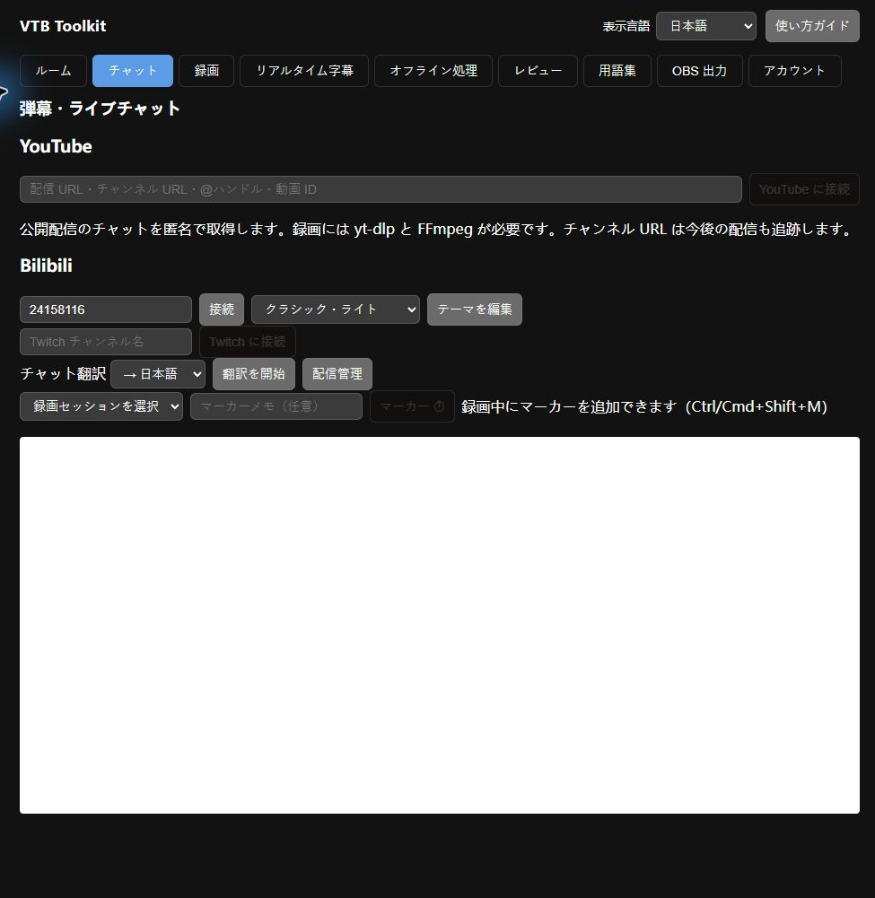

Windows の実画面・クリックで拡大 (ja)

## ルーム管理と両プラットフォーム

1. Bilibili：ルーム画面で数字のルーム ID を追加します。カードには画像・配信者・カテゴリ・配信中/再放送/未配信の状態が表示され、30 秒ごとに更新されます。カードからチャット接続、録画開始/停止、お気に入り削除ができます。

2. YouTube：公開配信 URL、動画 ID、@ハンドル、チャンネル URL を入力します。動画 ID は特定の配信、チャンネル登録は新しい配信の検出に使います。チャットを接続し、録画前に録画画面で保存先を設定してください。

3. YouTube チャットは API キーや Google ログインなしで匿名取得します。メンバー限定、年齢・地域制限、未配信、チャット無効の配信は取得できない場合があります。Web インターフェースを利用するため、YouTube の変更時にはアプリ更新が必要になることがあります。

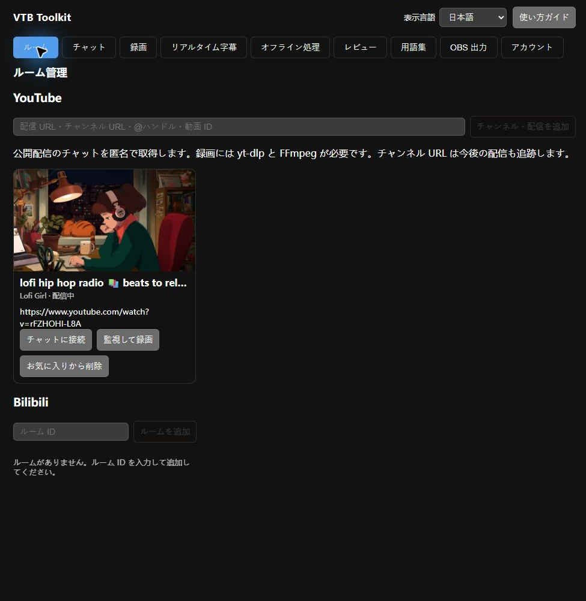

Windows の実画面・クリックで拡大 (ja)

## チャット・翻訳・視聴者メモ

1. チャット画面で複数の Bilibili ルームや YouTube お気に入りを接続できます。Twitch 欄では匿名でチャンネルチャットに接続できます。通常メッセージ、ギフト、SC、ステッカー、メンバーイベントに加え、絵文字・アバター・プラットフォーム名を表示します。

2. 翻訳先（中・英・日・韓）を選び、翻訳を有効にします。事前に「設定 → AI サービス → テキストモデル」で接続設定を保存してください。訳文はアプリと OBS のチャットに表示されます。表示言語を変えても翻訳先は変わりません。

3. ユーザー名をクリックして視聴者メモを付けます。空欄で保存するとタグが消えます。プラットフォーム別の識別子で保存されるため同名でも混同しません。匿名の Bilibili 接続では名前が伏せられることがあり、ログインで改善する場合があります。

4. YouTube の削除・モデレーションイベントに応じて該当表示を除去し、切断時は再接続します。チャット接続と録画監視は独立しているため、チャット停止だけでは録画は止まりません。

Windows の実画面・クリックで拡大 (ja)

## チャットのテーマと表示

1. チャットのテーマ選択から内蔵テーマを選び、編集を開きます。色、文字サイズ・フォント、行間、角丸、入場アニメーション、時刻、ファンバッジを調整できます。

2. 内蔵テーマの編集は名前を付けられるコピーを作ります。保存すると選択欄に追加され、JSON の書き出し・貼り付けによる読み込みもできます。OBS 出力では別途テーマを選び、新しい URL を OBS に貼り直してください。

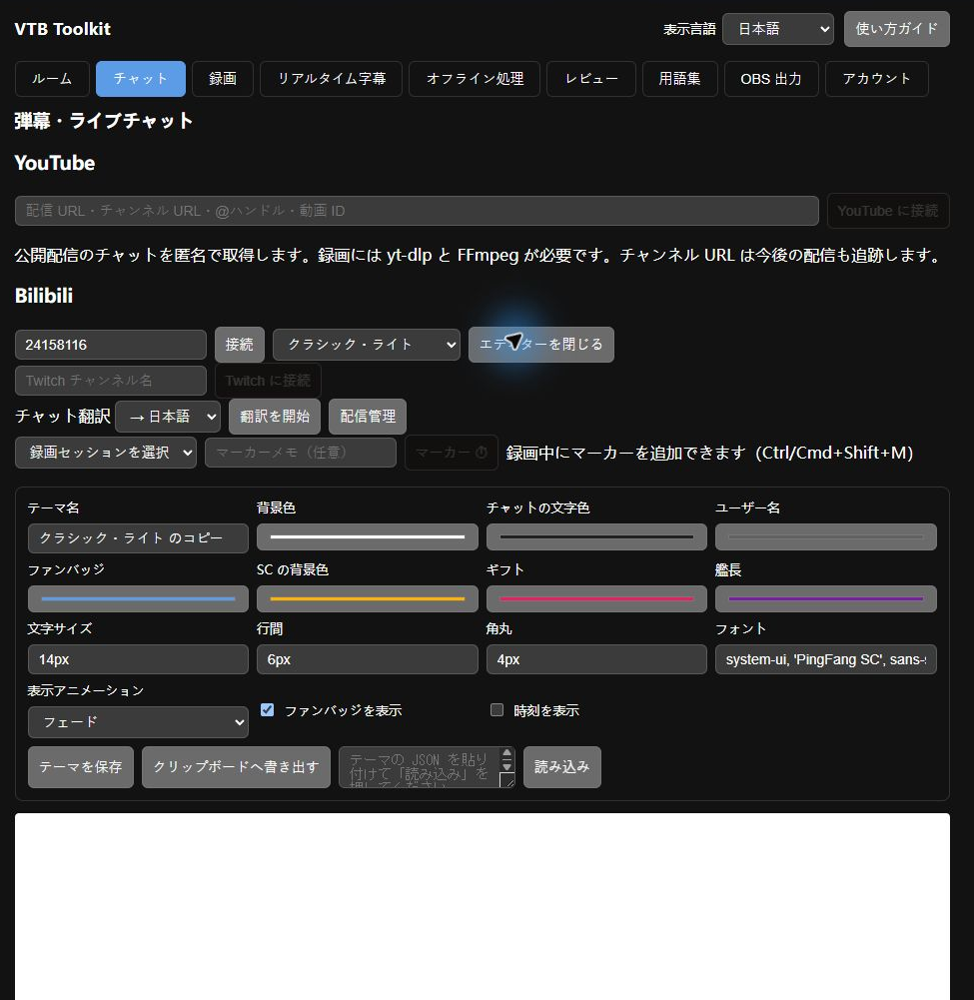

Windows の実画面・クリックで拡大 (ja)

## Bilibili の配信管理

1. アカウント画面でログインし、チャットで Bilibili ルームを選んで配信管理を開きます。送信欄は本人のアカウントで発言します。ギフト・加入・SC の自動お礼を有効にする前にテンプレートと条件を確認してください。YouTube の送信・自動お礼には対応していません。

2. ギフトのお礼にはパネルの変数（例：{user}、{gift}、{count}）を使います。加入・SC は内蔵テンプレートを使います。定期メッセージと間隔を入力して開始します。間隔は 30 秒以上です。停止ボタンで終了し、送信内容を確認してから有効にしてください。

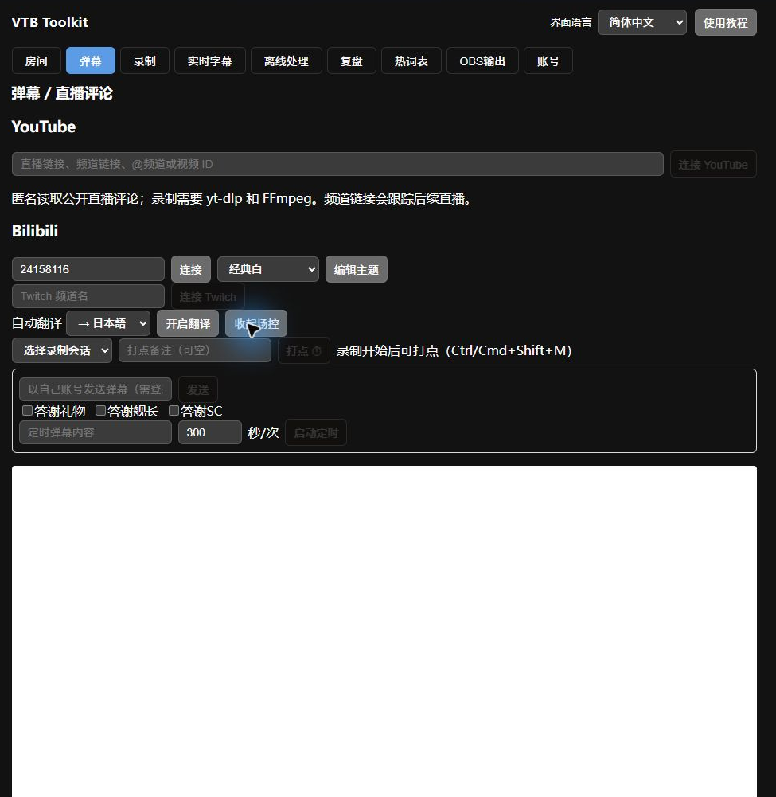

Windows の実画面・クリックで拡大 (zh-CN)

## 自動録画・分割・保存期間

1. 録画画面で書き込み可能な保存先と Bilibili ルーム ID、または YouTube/Twitch URL を入力します。分割なし・時間（秒）・サイズ（バイト）を選んで監視を開始します。未配信なら待機し、チャンネル URL では次の配信も監視できます。

2. 監視一覧とログで状態を確認します。停止すると現在の録画を終了してファイルを整理します。切断時は再取得して新しい分割ファイルに続録しますが、切断中の欠落は防げない場合があります。YouTube の映像・音声トラックは yt-dlp で取得します。

3. 出力は配信元・セッション別に整理されます。解析に使う meta.json、チャット JSONL/XML、markers.jsonl を含め、フォルダー全体を保持してください。MP4 変換に失敗した場合は保持された MKV/FLV とログを確認します。

4. 自動整理は 3 項目とも 0（無効）が初期値です。保存日数・ルーム別セッション数・空き GiB 目標を設定すると条件に合う古い録画が削除されます。重要な素材は先にバックアップしてください。容量不足では監視を停止します。

5. Bark・ServerChan・Telegram・独自 Webhook で開始・完了・異常を通知できます。サービスの URL・トークンを設定して保存すると、録画イベントが設定先へ実際に通知されます。

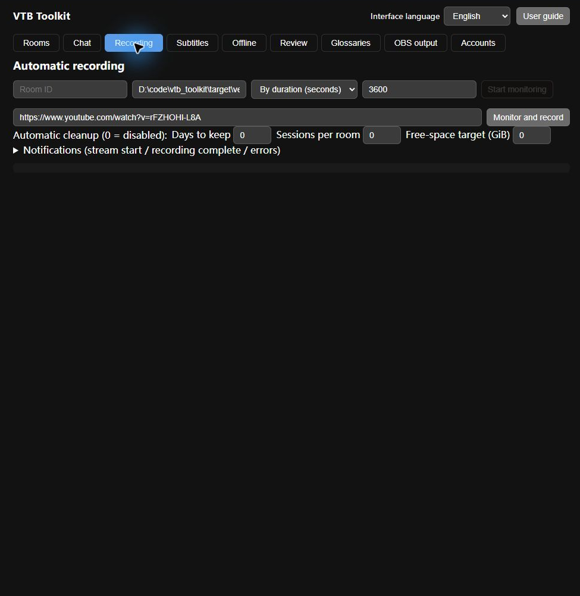

Windows の実画面・クリックで拡大 (en)

## 配信中のマーカーとハイライト通知

1. 録画開始後、チャット画面にマーカー対象のセッションが表示されます。bilibili:ルームID または youtube:動画ID を選び、任意のメモを入力して追加します。複数録画中は必ず対象を選択してください。

2. 全体ショートカットは Ctrl+Shift+M（macOS は Cmd+Shift+M）です。Bilibili のモデレーターは「打点 メモ」を送信して追加することもできます。YouTube ではこのコマンドを使いません。チャット急増は自動ハイライト通知・マーカーの対象になります。

3. マーカーは録画の時間軸に合わせて markers.jsonl に保存されます。後から確認し、オフライン解析の候補に使うほか、説明欄・コメント用のタイムスタンプにも書き出せます。

Windows の実画面・クリックで拡大 (ja)

## リアルタイム字幕・Whisper・同時翻訳

1. リアルタイム字幕で Bilibili ルーム ID または YouTube URL、原語（または自動判定）、モデルパス、用語集を選びます。一覧からモデルを取得して選択し、字幕処理を開始します。

2. tiny は簡単な動作確認、small は速度と精度のバランスに向きます。大型モデルには高性能 PC が必要です。認識はローカルで行い、雑音・音楽・処理性能によって精度や遅延が変わります。用語集は人名やゲーム用語に役立ちます。

3. 翻訳には有効な LLM 設定と翻訳先の指定が必要です。原文・訳文は一覧と OBS 字幕に表示され、配信ごとに停止できます。リアルタイム字幕は現在メモリ内のみです。SRT/ASS の保存には録画をオフライン処理してください。

4. 翻訳は「設定 → AI サービス → テキストモデル」で管理します。ショートカットで設定・保存し、字幕画面へ戻ってタスクを再開始してください。

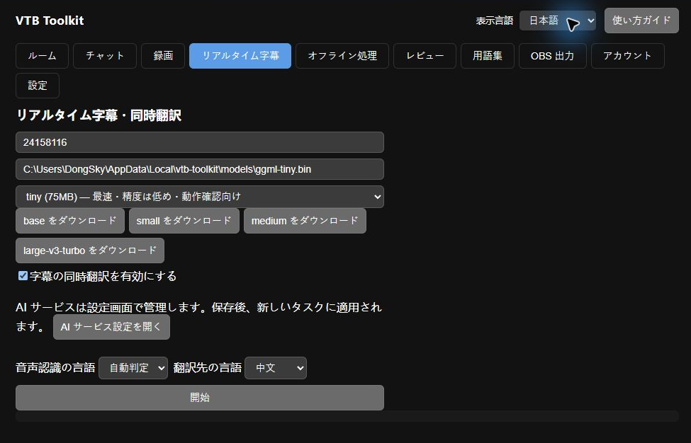

Windows の実画面・クリックで拡大 (ja)

## 設定 → AI サービス：テキストモデル

1. 上部の「設定」を開きます。テキストモデルはチャット・字幕翻訳、意味解析による粗編集、用語整理、サムネイル案に使います。映像解析・画像生成は別タブです。ローカルの Whisper 音声認識に LLM の API キーは不要です。

2. OpenAI 互換または Anthropic を選び、Base URL とモデル名を入力します。OpenAI 互換は通常 /v1 まで、Anthropic は通常 https://api.anthropic.com です。/chat/completions や /messages は付けません。自前サーバーも選択した API への対応が必要です。

3. API キーを入力して「設定を保存」を押します。キーは用途・API 種別・URL ごとに OS の資格情報ストアに保存され、通常の settings.json には入りません。空欄で保存すると現在のサービスのキーを保持し、入力すると更新します。キー不要のローカルサービスでは「認証不要」を選べます。

4. 変更を保存してから「接続テスト」を押します。テキストは固定の短文、映像解析はテスト画像も送信するため、少額の API 料金が発生する場合があります。「現在有効な設定」で新規タスクの接続先・モデル・キーの取得元を確認できます。

5. 環境変数を許可すると、URL・モデルは「入力済み設定 → 環境変数 → 既定値」、キーは「OS 資格情報ストア → 対応する環境変数」の順になります。テキスト・映像解析は選択した API の OPENAI_* または ANTHROPIC_*、画像生成は IMAGE_*（API_KEY・BASE_URL・MODEL）です。環境のキーはそこで指定した URL または対応する公式 URL にだけ使用します。

6. 「保存済みキーを削除」は現在の用途・種別・URL のキーだけを削除します。環境変数を許可していれば、そのキーは引き続き使われる場合があります。新 URL のキーは別途設定します。旧 URL のキーを消す場合は旧 URL に戻して保存してください。実行中のタスクには停止・再開始後に新設定が適用されます。

7. 初回に旧テキスト設定・保存済みキーと、旧サムネイルの URL・モデルを移行します。旧画像キーはメモリ内のみだったため再入力が必要です。旧共有キーは旧版への復帰用に残し、新版は移行後の用途別資格情報だけを読みます。

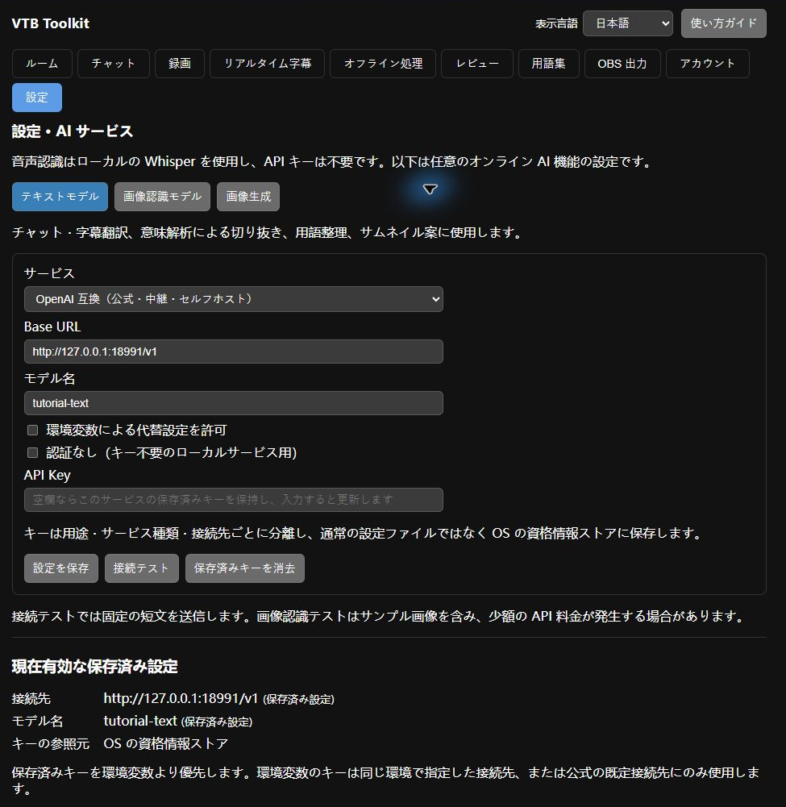

Windows の実画面・クリックで拡大 (ja)

## 映像解析モデル：共有と個別設定

1. 初期状態では「テキストモデルの設定を共有」が有効です。テキストの URL・モデル・キーを使うため、モデルは画像入力に対応している必要があります。この状態では映像解析タブから共有キーを削除できません。

2. 別の映像解析モデルを使う場合は共有を解除し、URL・モデル・キーを設定して保存・テストします。オフラインのフレーム解析とハイライト確認はこの設定、翻訳はテキスト設定を使用します。

3. ガイドの接続テストはローカルの模擬サービスとサンプルモデルで、要求形式・設定・エラー表示を確認しています。画像内の成功表示は外部モデルの利用確認ではありません。実際の AI 処理は必要な文字や画像を保存済みサービスに送信します。

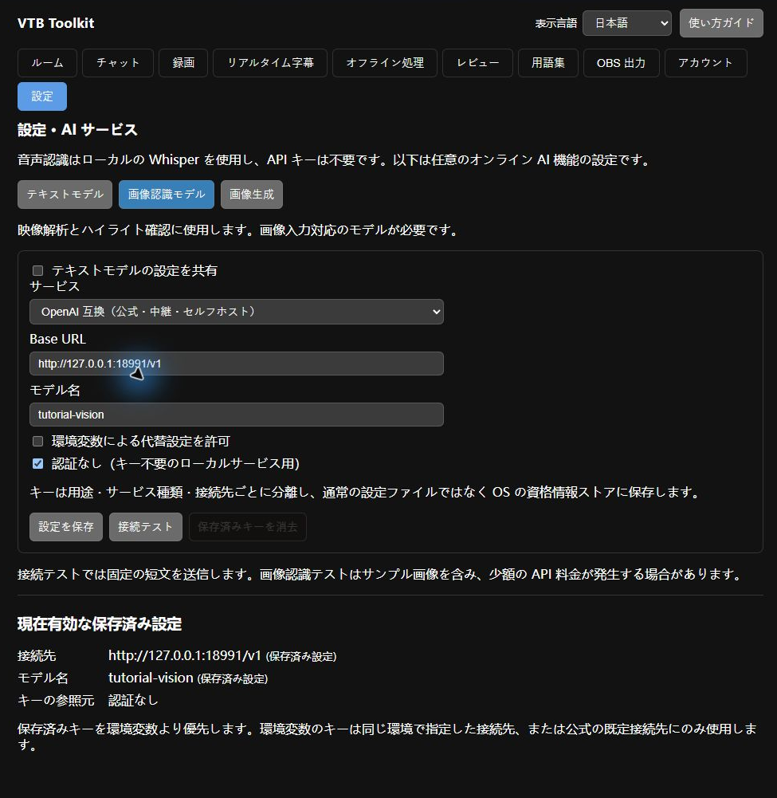

Windows の実画面・クリックで拡大 (ja)

## 画像生成：専用サービスとテスト範囲

1. 「設定 → AI サービス → 画像生成」で専用の OpenAI 互換 URL・画像モデル・キーを保存します。画像キーも OS の資格情報ストアに保存され、再起動後も保持されます。

2. 接続テストは GET /models でモデル名を確認するだけで、有料画像を生成しません。成功はモデル照会の確認で、images/generations・images/edits 権限の確認ではありません。/models 非対応の中継もあるため、失敗時はサービスの仕様も確認してください。

3. 確認画面のサムネイル機能へ戻り、プロンプト・サイズを指定して生成します。候補フレーム未選択ならテキストから生成、選択済みなら参照画像による編集です。接続先・モデルの対応が必要です。この画面から画像サービス設定を直接開くこともできます。

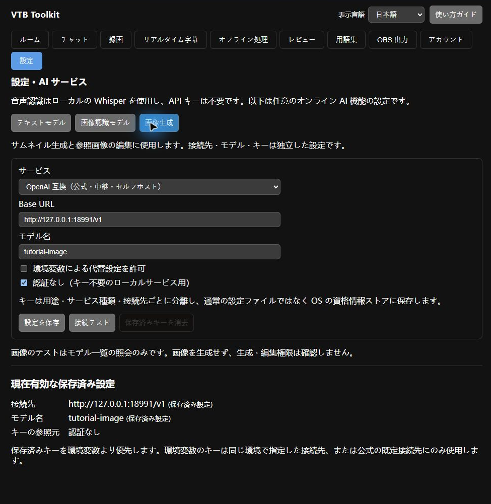

Windows の実画面・クリックで拡大 (ja)

## オフライン処理と AI 粗編集

1. 録画ファイル、出力先、Whisper モデルを入力します。原語・用語集・翻訳の有無・翻訳先を選びます。チャット JSONL を指定するか、動画付近のログを自動検出させます。元のセッションフォルダーは保持してください。

2. 音声抽出→認識→任意の翻訳→字幕出力→ハイライト検出→切り抜きの順で処理します。transcript.json、SRT/二言語 ASS、signals.json、highlights.json、切り抜きを出力します。字幕焼き込みには libass 対応 FFmpeg が必要です。

3. 意味解析は文字起こしからネタ・展開・プレイを、映像解析は間隔ごとのフレームから見どころを探します。初期状態は無効で個別に有効化できます。前後余白・最大切り抜き数・抽出間隔を指定します。短い間隔ほど API 利用量が増え、失敗したバッチは省略されることがあります。

4. 楽曲モードでは歌の区間を検出して個別出力できます。完了後は出力フォルダーを確認画面で開き、自動候補を目視確認してください。複数分割の録画は各ファイルを指定して処理し、全体が自動連結されるとは想定しないでください。

5. 意味解析の粗編集はテキストモデル、フレーム解析・確認は映像解析モデルを使います。オフライン処理の前に対応する設定を保存してください。

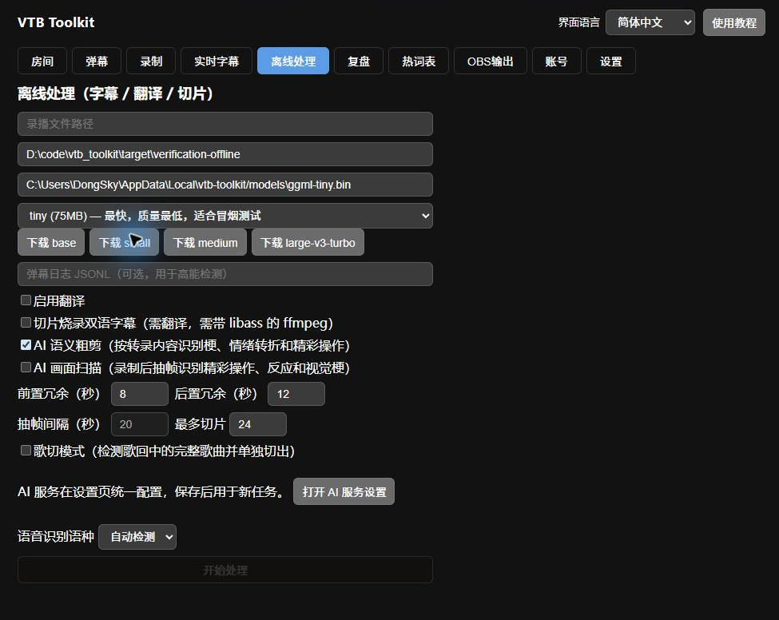

Windows の実画面・クリックで拡大 (zh-CN)

## タイムライン・統計・手動切り抜き

1. 確認画面でセッションまたはオフライン出力フォルダーを読み込みます。タイムラインをクリックして移動、ドラッグして範囲を選び、切り抜きを出力します。WebView で再生できない場合は MP4 プロキシを作成します。再エンコードに時間と容量が必要です。

2. 赤はチャット密度、青は音声エネルギー、オレンジの背景はハイライトです。緑の線は手動、オレンジは自動マーカー、黄は SC、紫はメンバー、灰は配信イベントです。一覧の時刻からも移動できます。

3. レポートにはメッセージ数、発言者数、ワードクラウド、ランキング、課金イベントがあります。通貨は別集計し、不明額は換算しません。現在の表示言語で Markdown と SC CSV を出力します。CSV 列名は解析用に固定し、視聴者の内容は原文を保持します。

4. 出力済み切り抜き一覧からプレビューや投稿を開けます。統計は保存済みログと解析結果に依存し、動画だけでは過去のチャット統計を復元できません。現在の動画検出は 1 分割を選ぶため、時間軸との対応を確認してください。

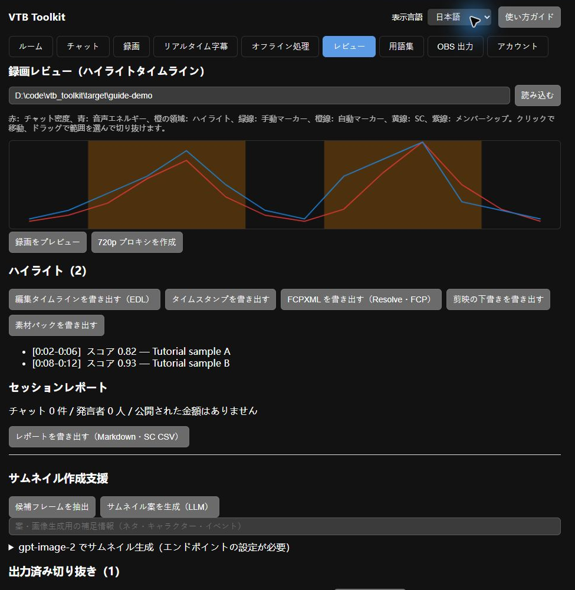

Windows の実画面・クリックで拡大 (ja) · 確認画面の曲線・ハイライトはチュートリアル用データです

## 編集プロジェクトと素材の書き出し

1. EDL は汎用編集交換、FCPXML は Final Cut Pro/DaVinci Resolve、剪映草稿は案内された剪映の草稿フォルダーにコピーして使用します。編集ソフトから元動画にアクセスできる必要があり、別 PC では素材を再リンクしてください。

2. タイムスタンプ出力は timestamps.txt を作成します。素材パックは既存の切り抜き・字幕・チャット XML・時刻一覧・候補画像をまとめます。未生成の素材は追加されないため、先にオフライン処理やフレーム抽出を行ってください。

Windows の実画面・クリックで拡大 (ja) · 確認画面の曲線・ハイライトはチュートリアル用データです

## サムネイルアシスタント

1. 確認結果を読み込んでサムネイル機能を使います。元動画から候補フレームを抽出し、キャラクター・ネタ・イベントなどの補足を加えて AI 案を生成します。タイトル・副題・構図・色・比率・プロンプトにはテキスト LLM が必要です。

2. 確認画面のサムネイル機能へ戻り、プロンプト・サイズを指定して生成します。候補フレーム未選択ならテキストから生成、選択済みなら参照画像による編集です。接続先・モデルの対応が必要です。この画面から画像サービス設定を直接開くこともできます。

3. 生成画像と抽出フレームは確認フォルダー配下に保存され、素材パックにも含められます。タイトルや画像の正確さを確認してください。画像サービスがなくてもローカルの候補フレームを利用できます。

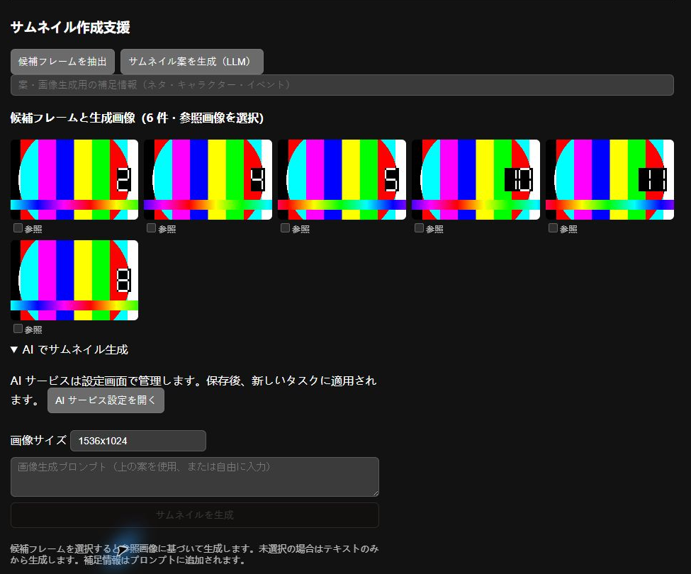

Windows の実画面・クリックで拡大 (ja) · 確認画面の曲線・ハイライトはチュートリアル用データです

## アカウントと切り抜き投稿

1. Bilibili はアカウント画面の QR コードを公式モバイルアプリで読み取ってログインします。資格情報は OS に保存され、ここでログアウトできます。この認証はチャット・取得用です。確認画面からの投稿には別途 biliup CLI と biliup login が必要です。

2. YouTube の閲覧にログインは不要ですが、投稿には公式 Google OAuth が必要です。Google Cloud で YouTube Data API を有効にし、デスクトップアプリの OAuth クライアントを作成します。ID・secret を入力保存し、ブラウザーで本人が認証してください。テスト中は自分をテストユーザーに登録します。

3. 確認済み切り抜きの YouTube 投稿を開き、タイトル・説明・カンマ区切りタグ・公開範囲・子ども向け設定を入力します。初期値は非公開です。キャンセルはローカル転送を止めますが、完了済み動画は削除されないため YouTube Studio で確認してください。

4. 未審査の Google クライアントには利用枠や公開範囲の制限がある場合があります。YouTube Studio で実際の結果を確認してください。このガイド作成ではアカウント作成・実認証・動画公開は行っていません。

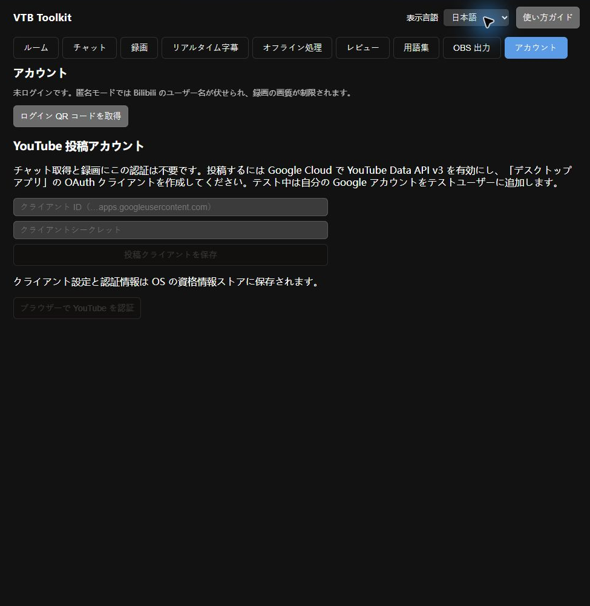

Windows の実画面・クリックで拡大 (ja)

## 用語集の管理

1. 用語集に名前と自由形式の語句（例：「帕克=Puck」、GPK の別名）を入力します。AI 整理には LLM が必要です。無効時はローカル規則で解析し、AI 不可用時も規則への切替を試みます。保存後に内容を確認してください。

2. 語句・別名・読み・訳・分類・メモを保持します。誤った語句や用語集全体を削除できます。2 件以上を選び新しい名前で結合できます。現在は確認・削除・再入力・結合に対応し、セル単位の直接編集はありません。

3. 保存しただけでは全タスクに適用されません。リアルタイム字幕やオフライン処理で必要な用語集を選択してください。名前や語句は表示言語を変えても原文を保持します。

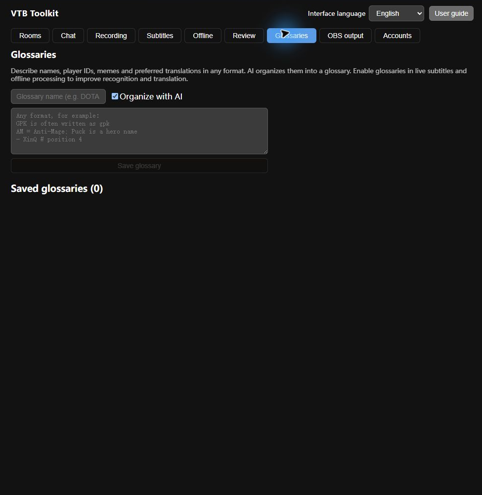

Windows の実画面・クリックで拡大 (en)

## 独立チャットページと OBS ブラウザーソース

1. チャットを接続してから OBS 出力でローカルサービス（初期ポート 18990）を開始します。127.0.0.1 のみで動作し、同じ PC の OBS・ブラウザーから使えます。全プラットフォームまたは 1 つを選び、配信フィルターを空欄にすると全配信を表示します。

2. 配信指定は bilibili:12345 または youtube:動画ID です。テーマ・文字サイズ・幅・行数・表示秒数・アバター・プラットフォーム名を設定します。0 秒は時間による消去なしですが行数制限は有効です。変更後は URL をコピーし直します。

3. OBS でブラウザーソースを追加してチャット URL を貼り、420×700 を目安に設定します。字幕は別のブラウザーソースを 1920×200 で追加します。ページは独立したブラウザーでも開けますが、ローカルアプリは起動したままにしてください。

4. プレビューの市松模様は透明を示し、本番 URL に preview=1 は付けません。lang=zh-CN/en/ja はページの案内だけを変更し、視聴者の発言は翻訳しません。固定ポートなら再起動後も URL を保てます。ポート変更時は OBS も更新してください。

5. 字幕 URL は size、hold（ミリ秒・初期値 6000）、room、platform を指定できます。字幕元を停止すると該当字幕が消えます。サービス停止後は再接続を待ちます。アプリ内ガイドも同じローカルサービスでオフライン提供します。

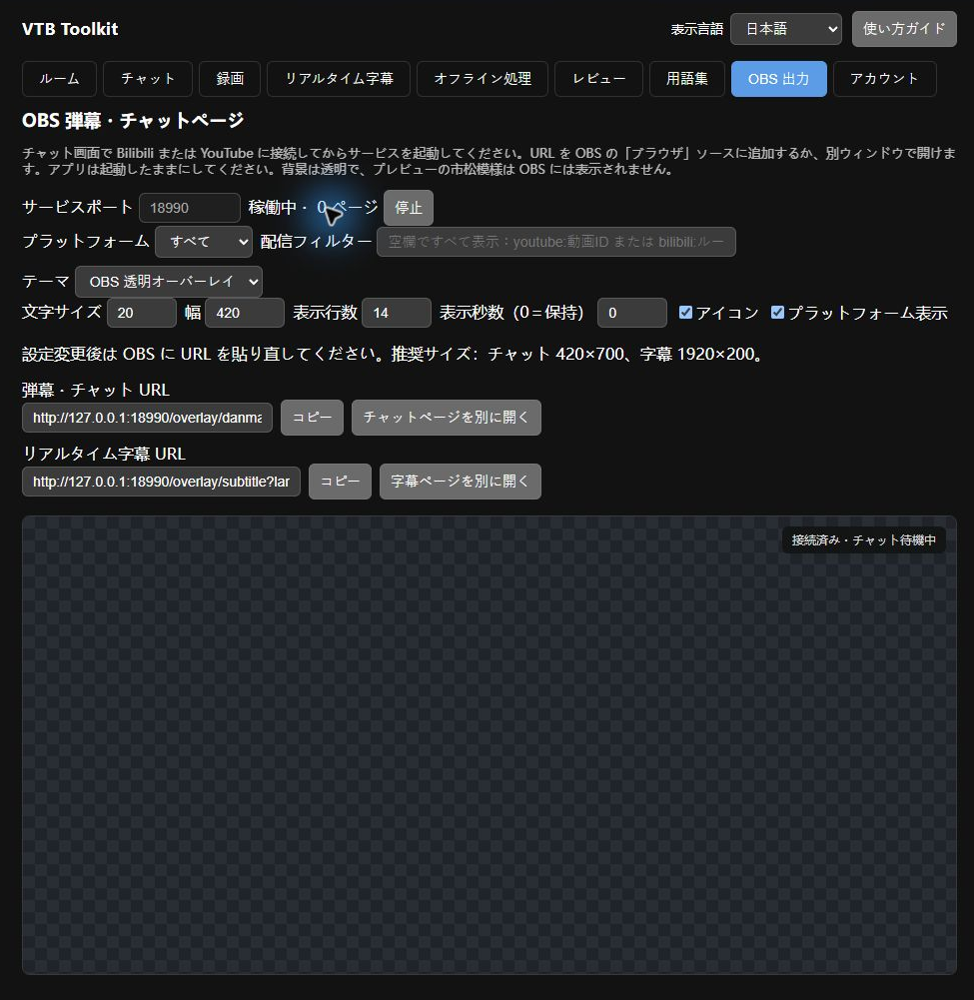

Windows の実画面・クリックで拡大 (ja)

## ローカルファイル・自動化・対応範囲

1. Windows の設定・モデルはユーザーのアプリデータ配下、録画は指定の保存先にあります。ルーム・パス・一般設定は保存されます。設定・セッション全体・用語集をバックアップし、別 PC では API/OAuth 資格情報を再設定してください。

2. ローカル /api/status はチャット・録画状態を同じ PC の自動化向けに提供します。リポジトリには ローカルスクリプトの hook、macOS say の読み上げ、録画・字幕のストリーム共有もありますが、現在のメイン画面に操作スイッチはありません。

3. この版は主に Windows で確認しています。macOS/Linux では依存ツールや資格情報ストアが異なります。実ログイン・投稿・有料 AI は本人の環境で確認してください。画像は実画面ですが、すべての外部サービスの動作確認を意味しません。

## 困ったとき

1. 起動時が空白：Vite 前提の古い開発実行ファイルではなく、今回の配布版を使用してください。WebView2 を確認し、エラー画面が出たら内容を記録して再読み込みします。開発時は scripts/dev-windows.ps1 を使用できます。

2. チャットなし：ブラウザーで配信・チャットを確認し、フィルター・接続・ネットワークを確認します。録画なし：保存先、空き容量、FFmpeg/yt-dlp、URL、ログを確認します。固定動画 URL は別配信へ切り替わりません。

3. OBS が空白：同じ PC でサービスが起動しているか、ポート・配信フィルターが正しいかを確認し、プレビューで接続状態を見ます。字幕なし：音声の有無、モデル・パス、原語・翻訳先、LLM 設定を個別に確認します。

4. オフライン失敗・切り抜きなし：短い MP4 で AI・焼き込みを無効にし、認識を確認してから 1 項目ずつ有効にします。ピークがなければハイライト 0 件も正常です。手動選択を使えます。認識の誤りはモデル・言語指定・音質で改善する場合があります。

5. 投稿・画像生成失敗：それぞれの認証情報、モデル権限、利用枠、API 互換性を確認します。エラーは記録し、画像にトークンを載せないでください。未知の外部エラーは診断のため原文のまま表示します。

6. AI テスト失敗：保存済み URL・モデル、キーの取得元、API 種別を確認します。HTTP 401/403 は認証・権限、404 はパスの誤りがよくある原因です。通信エラーではプロキシ・証明書・サーバーの起動状態を確認し、変更を保存して再テストしてください。
