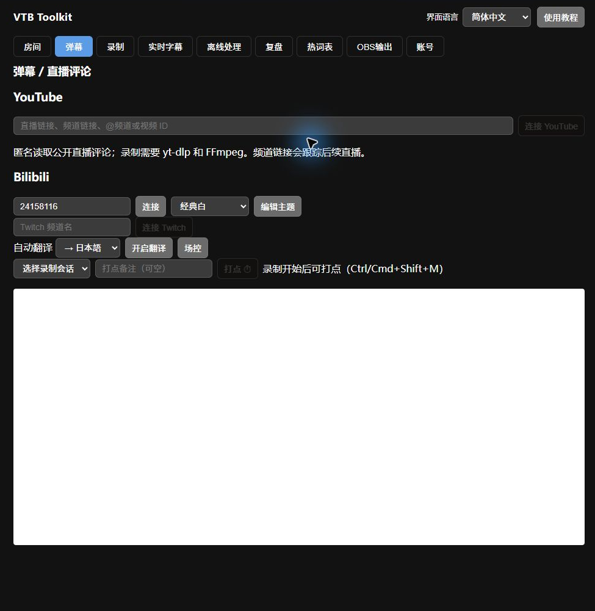
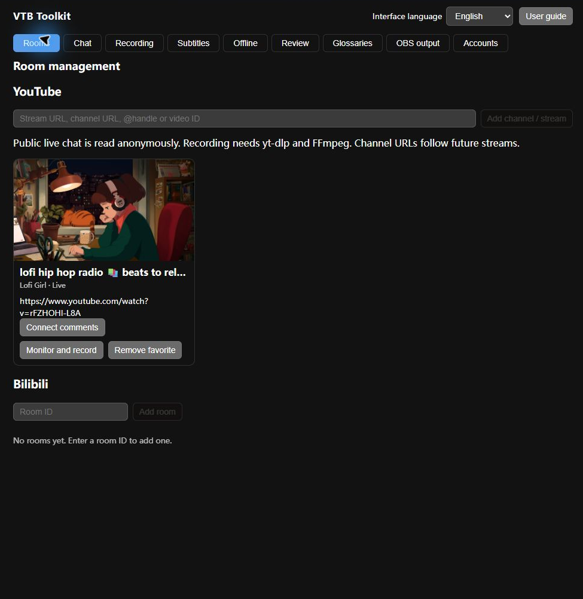
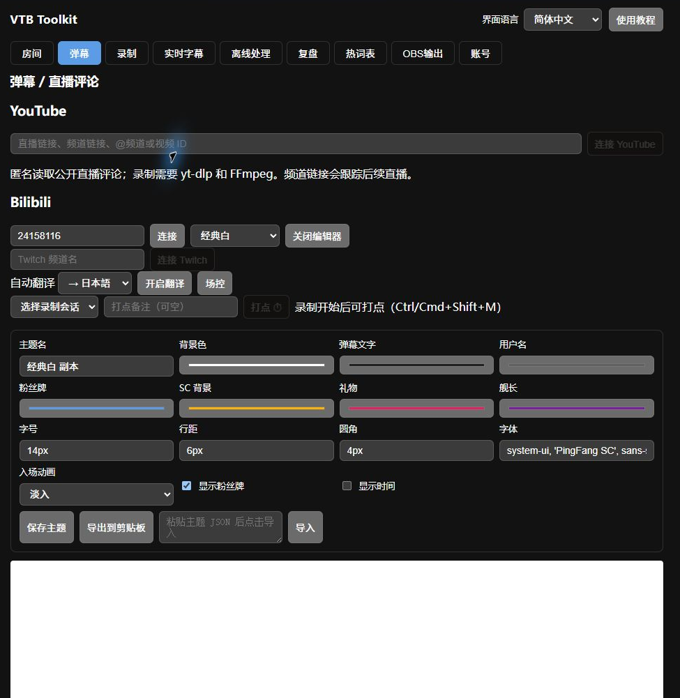
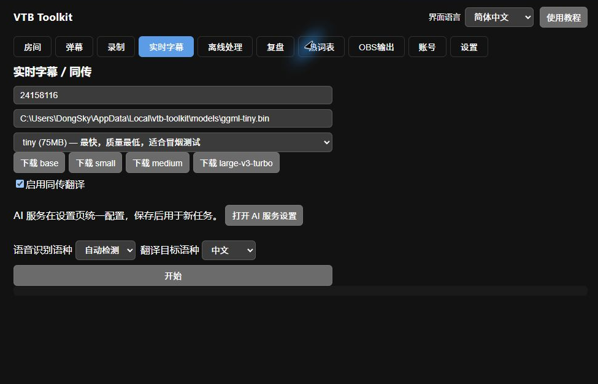
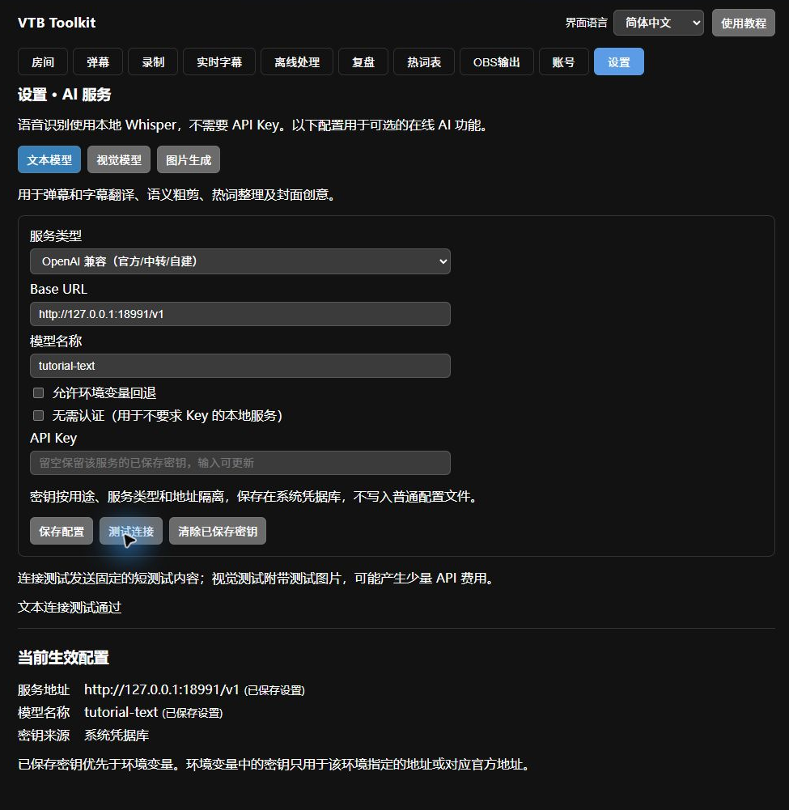
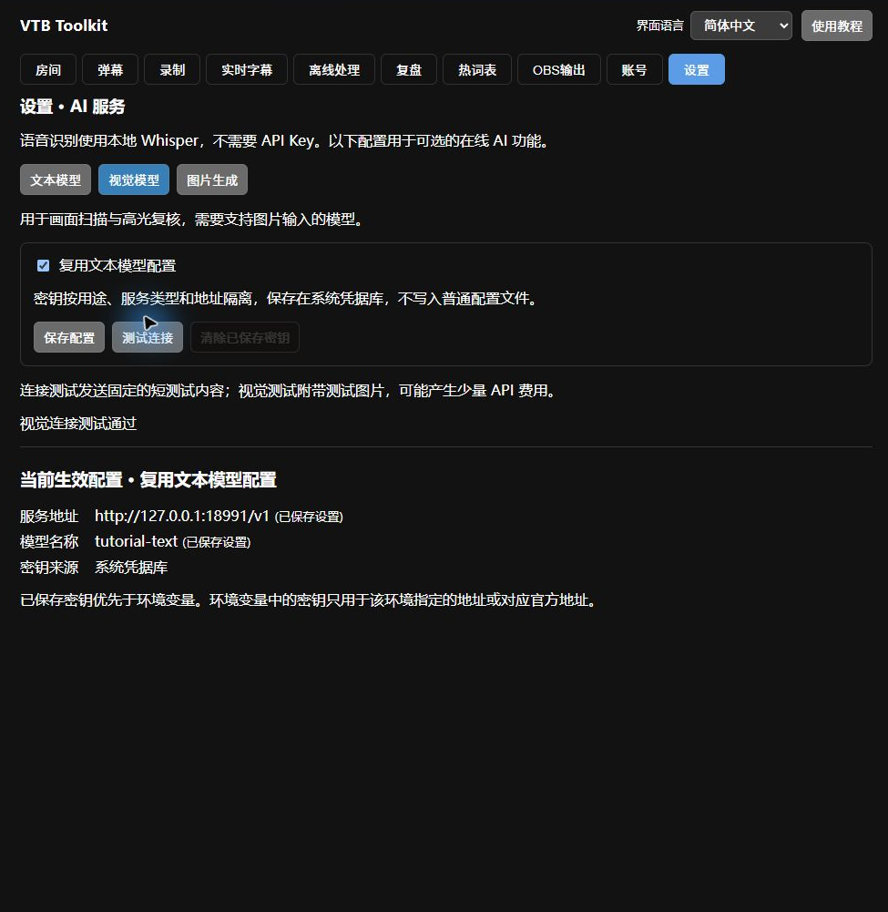
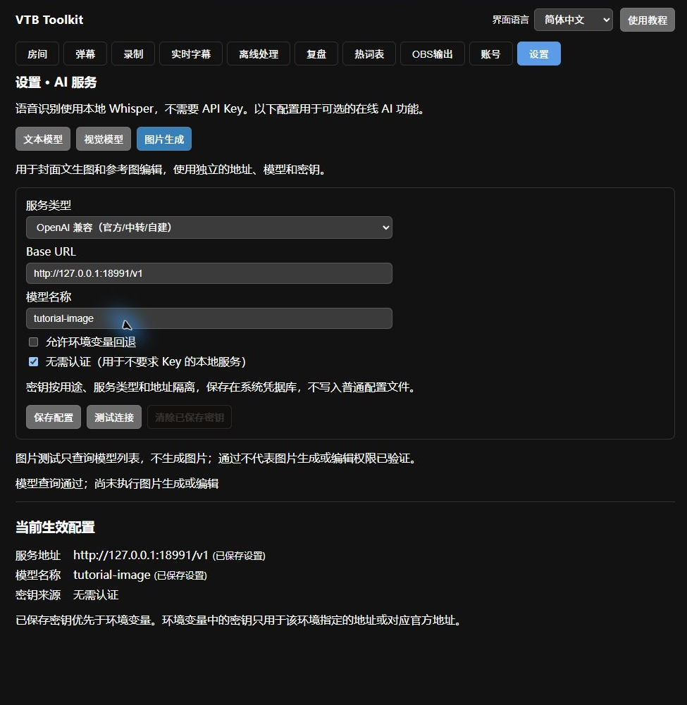
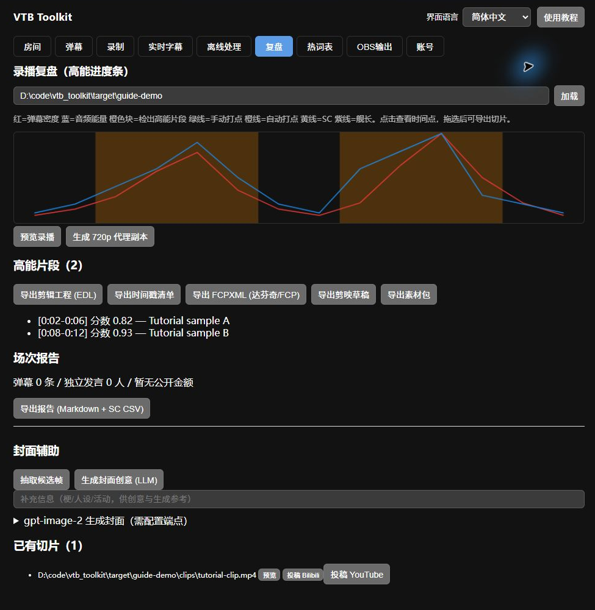
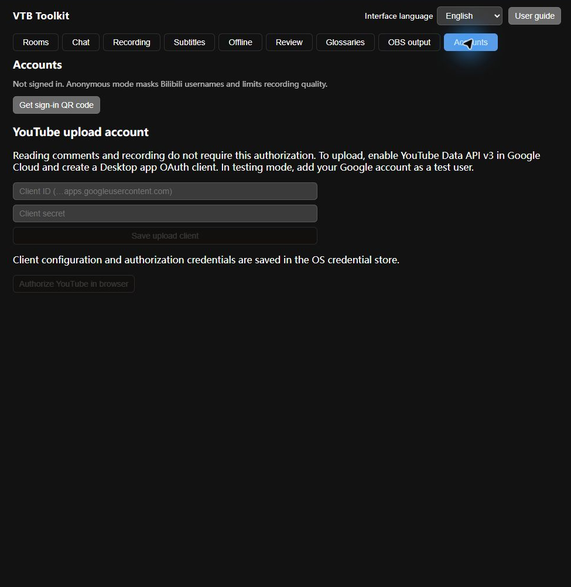
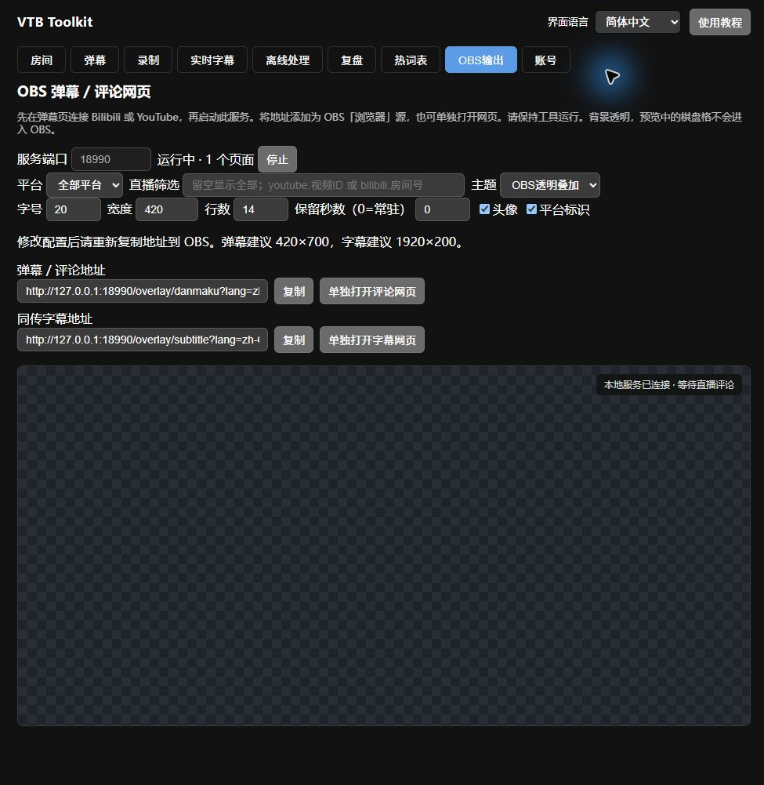

# VTB Toolkit 使用手册

从直播到切片，一份可以离线阅读的完整指南

适用于主播、场控、录播员和切片创作者。点击截图可放大；顶部可切换三语或打印为 PDF。

版本 0.1.0 · 更新于 2026-09-13

## 开始使用与三语界面

1. 启动 Windows 安装版或 vtb-toolkit.exe。顶部依次是语言选择、使用教程和十个功能页签。选择简体中文、English 或日本語后立即生效，重启会记住选择。

2. 界面语言不会改变语音识别语种、翻译目标、昵称、聊天原文、备注或已填写的投稿内容。切换语言不会重新启动当前页的任务。

3. 录制、抽帧和切片需要 FFmpeg/ffprobe；YouTube/Twitch 取流需要 yt-dlp。将它们加入 PATH；Windows 的 yt-dlp 也可放在程序旁边。Whisper 模型在字幕页下载，文本 AI 需要自己的接口配置。

4. 推荐流程：先选输出目录并收藏直播 → 连接评论及录制 → 打点/实时字幕/OBS → 下播后离线分析 → 复盘、封面、导出与投稿。

Windows 实际界面 · 点击放大 (zh-CN)

## 房间收藏与双平台连接

1. Bilibili：在房间页输入数字房间号并添加。卡片展示封面、主播、分区及直播/轮播/未开播状态，每 30 秒刷新。卡片可连接弹幕、开始/停止录制或移除收藏。

2. YouTube：输入公开直播链接、视频 ID、@频道名或频道链接。固定视频只对应那场直播；频道收藏可发现频道的新直播。点击连接评论；录制前先在录制页设置输出目录。

3. YouTube 评论优先匿名读取，不需要 API Key 或 Google 登录。会员限定、年龄限制、地区限制、未开播或已关闭评论的直播可能无法读取。匿名读取依赖 YouTube 网页接口，网站改版后可能需要更新软件。

Windows 实际界面 · 点击放大 (en)

## 评论、翻译和观众备注

1. 弹幕页可输入 Bilibili 房间号连接多个房间，也可管理 YouTube 收藏；Twitch 栏可匿名连接频道。列表显示普通消息、礼物、SC、贴纸和会员事件，支持表情、头像及平台标识。

2. 选择翻译目标（中/英/日/韩），点击开启翻译。先在“设置 → AI 服务 → 文本模型”保存接口配置；译文会同时出现在工具和 OBS 评论层。界面语言不会自动设置这个目标。

3. 点击用户名可写观众备注，空备注会清除标签。备注按平台身份分开保存，避免同名观众混淆；原始昵称、评论及备注不会被界面国际化改写。B 站匿名连接可能只显示脱敏昵称，登录后可改善。

4. YouTube 删除消息及封禁相关事件会同步移除相应显示；断线会重连。阅读连接与录制监听是独立的，停止看评论不等于停止录制。

Windows 实际界面 · 点击放大 (zh-CN)

## 弹幕主题与样式

1. 在弹幕页的主题选择器切换内置主题，点击编辑打开样式面板。可以改颜色、字号、字体、行距、圆角、入场动画、时间显示和粉丝牌显示。

2. 编辑内置主题会生成可命名的副本。保存后自定义主题出现在选择器中；可导出 JSON 备份或粘贴 JSON 导入。OBS 页单独选择主题并把新地址复制到 OBS，已粘贴的旧地址不会自动更新。

Windows 实际界面 · 点击放大 (zh-CN)

## Bilibili 场控

1. 在账号页登录后，回到弹幕页选择 B 站房间并展开场控。发送框以你的账号发言；开启礼物、上舰或 SC 自动答谢前，检查模板和触发条件。YouTube 不提供评论发送或自动答谢。

2. 礼物答谢模板使用面板列出的变量（如 {user}、{gift}、{count}）；会员/SC 使用内置模板。定时弹幕输入内容与间隔后启动，间隔至少 30 秒；用停止按钮结束。所有发送类设置均应在了解实际内容后启用。

Windows 实际界面 · 点击放大 (zh-CN)

## 自动录制、分段与保留策略

1. 进入录制页，填写可写的输出目录和 B 站房间号，或输入 YouTube/Twitch 直播 URL。选择不切分、按时长（秒）或按大小（字节），点击开始监听。监听会等待开播；频道 URL 可继续等待下一场直播。

2. 监听列表和底部日志显示状态。停止时会结束当前录制并整理文件；断流时程序尝试重新取流并续录到新分段，不能保证网络中断期间没有缺失。YouTube 通过 yt-dlp 获取视频和音频轨。

3. 输出按来源及场次组织。视频之外还有 meta.json、弹幕 JSONL/XML、markers.jsonl 等日志，分析时应保留整场目录。MP4 整理失败时检查仍保留的原始 MKV/FLV 和日志。

4. 滚动清理默认三项都为 0（关闭）。设置保留天数、每房间场次数或目标剩余 GiB 会删除符合策略的旧录播；重要素材请先备份。磁盘不足时监控会安全停止。

5. 通知设置支持 Bark、ServerChan、Telegram 或自定义 Webhook，用于开播、完成和异常提醒。按各服务填写地址/令牌并保存后，录制事件会实际推送到配置目标。

Windows 实际界面 · 点击放大 (en)

## 直播打点与高能提示

1. 开始录制后，弹幕页会出现可打点的录制会话。选择 bilibili:房间号 或 youtube:视频ID，填可选备注，点击打点。多个录制同时运行时务必指定目标。

2. 全局快捷键为 Ctrl+Shift+M（macOS 为 Cmd+Shift+M）。B 站房管还可发送“打点 备注”触发；YouTube 不使用这条房管口令。弹幕密度峰值可自动产生高能提示及自动打点。

3. 打点写入 markers.jsonl 并对齐录制时间轴。下播后在复盘中查看，或离线分析时作为候选片段依据；可导出时间戳列表用于简介和评论。

Windows 实际界面 · 点击放大 (zh-CN)

## 实时字幕、Whisper 模型与同传

1. 在实时字幕页输入 B 站房间号或 YouTube 链接，选择源语种（或自动检测）、模型路径及热词表。模型列表可直接下载；下载完选择模型，再开始字幕任务。

2. tiny 适合快速验证；small 适合速度/精度平衡；更大的模型需要更强硬件。识别在本机运行，噪声、音乐及低配机器可能降低准确率或造成延迟。热词表有助于人名和游戏术语。

3. 启用翻译并选择目标语言时，需要有效 LLM 配置；原文及译文会显示在列表并发送到 OBS 字幕条。每个来源可独立停止。当前实时字幕只在内存展示，要保存 SRT/ASS 请对录播运行离线处理。

4. 翻译配置在“设置 → AI 服务 → 文本模型”统一管理；页面中的设置按钮可直接跳转，保存后返回字幕页重新开始任务。

Windows 实际界面 · 点击放大 (zh-CN)

## 设置 → AI 服务：文本模型

1. 打开顶部“设置”页签。文本模型用于弹幕/字幕翻译、语义粗剪、热词整理和封面创意；视觉与图片生成有各自的子页签。Whisper 语音识别在本机运行，不需要大模型 API Key。

2. 选择 OpenAI 兼容或 Anthropic，填写 Base URL 和模型名称。OpenAI 兼容地址通常以 /v1 结尾；Anthropic 通常填写 https://api.anthropic.com。不要附加 /chat/completions 或 /messages。自建服务需支持所选 API。

3. 输入 API Key 后点“保存配置”。Key 按用途、服务类型和地址隔离，存入系统凭据库；普通 settings.json 不含 Key。留空保存会保留当前服务的已存 Key，输入新值则更新。无需 Key 的本地服务可勾选“无需认证”。

4. 改动后先保存，再点“测试连接”。文本测试只发送固定短文本，视觉测试还发送一张测试图片，可能产生少量 API 费用。底部“当前生效配置”显示已保存任务实际使用的地址、模型和密钥来源。

5. 允许环境变量回退时，地址和模型按“已填设置 → 环境变量 → 默认值”取值，密钥按“系统凭据库 → 匹配环境变量”取值。文本和视觉分别使用所选服务的 OPENAI_* 或 ANTHROPIC_*；图片服务使用 IMAGE_*（API_KEY、BASE_URL、MODEL）。环境 Key 只用于其指定地址或对应官方地址。

6. “清除已保存密钥”只删除当前用途、类型、地址对应的 Key；若允许环境回退，清除后仍可能使用环境 Key。改地址后需为新地址单独配置；要清除旧地址的 Key，先切回并保存旧地址。正在运行的任务需停止后重启才使用新配置。

7. 首次打开会迁移旧文本配置及已存密钥，并保留旧封面地址和模型。旧版封面 Key 仅在内存中，需重新输入保存。旧共享 Key 保留用于回退旧版，新版只读取迁移后的独立凭据。

Windows 实际界面 · 点击放大 (zh-CN)

## 视觉模型：复用或独立配置

1. 默认勾选“复用文本模型配置”，视觉分析使用文本服务的地址、模型和 Key。共用模型必须支持图片输入；此模式不能在视觉页删除文本 Key。

2. 需要不同视觉模型时取消复用，填写该页的地址、模型和 Key，保存后测试。离线处理的画面扫描与高光复核会读取这组配置，文本翻译继续使用文本页的配置。

3. 本教程连接测试使用本机模拟服务和示例模型，只用于验证请求格式、设置和错误显示；截图中的测试通过不代表任何远端模型已认证可用。实际 AI 会把所需文本或画面发送至你保存的服务。

Windows 实际界面 · 点击放大 (zh-CN)

## 图片生成：独立服务与测试范围

1. 在“设置 → AI 服务 → 图片生成”填写独立的 OpenAI 兼容地址、图像模型和 Key，再保存。图像 Key 同样存入系统凭据库，重启后仍有效。

2. 图片“测试连接”仅 GET 查询 /models 并检查模型名称，不生成收费图片；通过只证明模型查询成功，不证明 images/generations 或 images/edits 权限。某些中转不提供 /models，测试失败也需结合服务文档判断。

3. 回到复盘的封面助手，填写 prompt 和尺寸，再生成图片。未选候选帧使用文生图；选中候选帧使用参考图编辑。端点和模型必须支持相应接口。此处也有按钮可直接打开图片服务设置。

Windows 实际界面 · 点击放大 (zh-CN)

## 离线处理与 AI 粗剪

1. 输入录播文件、输出目录及 Whisper 模型。选择源语种、热词表、是否翻译及目标语种；可手动填写弹幕 JSONL，否则尝试从录播附近发现日志。先保留与视频对应的原始场次目录。

2. 标准处理依次提取音频、识别、可选翻译、导出字幕、检测高能并切片。输出包含 transcript.json、SRT/双语 ASS、signals.json、highlights.json 和切片。开启烧录双语字幕需要带 libass 的 FFmpeg。

3. AI 语义粗剪分析转录中的梗、反转和操作；画面扫描按间隔抽帧寻找视觉高光。默认关闭，可分别开启；设置前后冗余、最大切片数和抽帧间隔。较小间隔意味着更多请求和更高成本，失败批次可能被跳过。

4. 歌切模式可检测并单独导出歌曲段落。完成后把输出目录填入复盘页检查结果；自动候选仍需人工审看。多段录播请分别选择文件处理，不要假定程序会自动拼接整场。

5. 语义粗剪使用文本模型，画面扫描与复核使用视觉模型；先在设置页保存对应配置，再启动离线任务。

Windows 实际界面 · 点击放大 (zh-CN)

## 复盘时间轴、统计与手动切片

1. 复盘页填写场次目录或离线输出目录并加载。点击时间轴定位预览，拖动选区后导出切片。若视频无法在 WebView 播放，可生成 MP4 代理副本后预览；这需要重编码时间和额外空间。

2. 曲线中红色代表弹幕密度，蓝色代表音频能量，高能区间有橙色底色；绿色为手动打点、橙色为自动打点、黄色为 SC、紫色为会员、灰色为开播等事件。点击列表时间可定位。

3. 场次报告包含消息数、独立发言者、热词云、发言榜和付费事件。币种分开统计，未知金额不强行换算。导出报告会保存当前界面语言的 Markdown 和 SC CSV；CSV 字段名保持稳定便于分析，观众内容保持原文。

4. 已有切片列表可预览和打开投稿。复盘依赖已有的日志与分析输出：只有视频而没有评论日志时，无法补回当时的弹幕统计。当前源视频查找会选择一个分段，请核实视频和时间轴对应。

Windows 实际界面 · 点击放大 (zh-CN) · 复盘曲线与高能为教程样例数据

## 剪辑工程与素材包导出

1. 复盘中的导出 EDL 用于通用剪辑交换；FCPXML 可供 Final Cut Pro / DaVinci Resolve 导入；剪映草稿导出后按提示复制到剪映草稿目录。目标剪辑软件仍需能访问原视频路径，跨电脑请重新链接素材。

2. 导出时间戳会生成 timestamps.txt；导出素材包集中复制切片、字幕、弹幕 XML、时间戳和封面候选等已存在文件。没有生成的素材不会凭空补出，先完成离线处理和封面抽帧。

Windows 实际界面 · 点击放大 (zh-CN) · 复盘曲线与高能为教程样例数据

## 封面助手

1. 在复盘加载结果后使用封面助手。抽取候选帧会从源视频采样；补充框可填写人设、梗、活动等上下文，再生成 AI 创意。创意包含标题、副标题、构图、配色、比例和图像 prompt，需要文本 LLM。

2. 回到复盘的封面助手，填写 prompt 和尺寸，再生成图片。未选候选帧使用文生图；选中候选帧使用参考图编辑。端点和模型必须支持相应接口。此处也有按钮可直接打开图片服务设置。

3. 生成结果及候选帧保存在当前复盘目录内，可加入素材包。AI 建议和图像需检查标题准确性与实际画面；无可用接口时仍可用本地候选帧制作封面。

Windows 实际界面 · 点击放大 (ja) · 复盘曲线与高能为教程样例数据

## 账号与切片投稿

1. Bilibili 在账号页使用手机客户端扫码，完成登录后展示账号状态；凭据保存在系统凭据库，可退出登录。扫码登录用于弹幕/取流等功能。复盘中的 B 站投稿还要求独立安装 biliup CLI 并执行 biliup login。

2. YouTube 阅读不需登录，投稿必须使用官方 Google OAuth。先在 Google Cloud 项目启用 YouTube Data API，创建桌面应用 OAuth 客户端，按账号页填客户端 ID/secret 并保存；测试状态需将自己加入测试用户，再在浏览器亲自完成授权。

3. 在复盘切片列表点投稿 YouTube，填写标题、说明、逗号分隔标签、可见性和是否儿童内容。默认私享；确认字段后上传。可取消本地传输，但若已传完需到 YouTube Studio 核实状态，取消不等于删除远端视频。

4. Google 未审核客户端可能受到配额或上传可见性限制；以 YouTube Studio 的实际结果为准。本教程没有替你创建账号、完成真实授权或发布视频。

Windows 实际界面 · 点击放大 (en)

## 热词表与术语管理

1. 热词表页输入表名和任意格式术语，例如“帕克=Puck”“GPK，别名鸡皮开”。启用 AI 规整需 LLM；不启用则本地规则解析，AI 不可用时也会尝试规则回退。保存后查看解析出的词条。

2. 条目包含词条、别名、读音、译法、类别及备注；可删除错误条目或整个表。勾选至少两张表并填写新名字可合并。当前界面提供查看/删除/重新导入与合并，没有逐格编辑功能。

3. 保存不会自动对所有任务启用；到实时字幕和离线处理页勾选所需表。原始表名及内容按输入保留，不随界面语言变化。

Windows 实际界面 · 点击放大 (en)

## 独立评论网页与 OBS 浏览器源

1. 先连接评论，然后在 OBS 输出页启动本地服务，默认端口 18990。服务只监听 127.0.0.1；同一电脑的 OBS 和浏览器可访问。选择全部平台或单个平台，来源筛选留空表示全部。

2. 指定来源时使用 bilibili:12345 或 youtube:视频ID。选择主题，设置字号、宽度、行数、保留秒数、头像和平台标识；0 秒表示常驻，但仍受最大行数限制。改完重新复制地址。

3. OBS 中添加“浏览器”源，粘贴评论地址，建议宽 420、高 700；字幕单独添加另一个浏览器源，建议 1920×200。评论网页无需主界面即可独立打开，但本地工具必须继续运行。

4. 界面预览的棋盘格仅表示透明背景，正式 OBS 地址不含 preview=1。语言参数 lang=zh-CN/en/ja 只控制网页提示，不翻译观众消息。固定端口使重启后的地址保持稳定；更改端口需更新 OBS。

5. 字幕网页支持 size（字号）、hold（毫秒，默认 6000）、room 和 platform 参数。停止指定字幕来源会清除对应字幕。停止叠加层服务后网页会等待重连；应用内教程也使用该本地服务提供离线页面。

Windows 实际界面 · 点击放大 (zh-CN)

## 本地文件、自动化与平台边界

1. Windows 配置和模型位于用户应用数据目录；日志和录播位于你指定的输出位置。目录、房间和常用参数会持久化。备份时保存配置、整场录播文件和热词表；API Key / OAuth 凭据需在另一电脑重新配置。

2. 本地服务的 /api/status 提供评论和录制状态，供本机自动化读取。仓库还有 本地脚本 hook、macOS say 弹幕 TTS、录制与字幕单流复用等后端能力；当前主界面未提供这些开关，本教程不把它们列为可直接点击的功能。

3. 当前版本主要验证 Windows；macOS/Linux 的依赖安装和凭据库不同。真实 B 站/Google 登录、远端投稿及付费 AI 服务需在自己的账号环境中确认。本教程截图展示实际界面；用于说明流程的数据不代表所有远端服务已验证。

## 常见问题与排查顺序

1. 启动空白：使用本次打包的可执行文件或安装包，避免直接运行依赖 Vite 的旧开发版。确认 Windows WebView2 可用；若出现界面错误页，记录错误再重新加载。开发者可用 scripts/dev-windows.ps1 启动完整后端开发环境。

2. 没评论：先在浏览器核实来源正在直播且评论可用，再检查平台/房间筛选、连接状态和网络。没录制：检查输出目录、磁盘空间、FFmpeg/yt-dlp 与直播 URL；查看录制日志，固定视频链接不会跳到另一场直播。

3. OBS 空白：确认服务已启动、OBS 与工具在同一电脑、端口未冲突；单独打开评论网页的预览模式检查连接。没字幕：确认有语音、模型已下载且路径正确；检查独立的源语种、目标语种和 LLM 设置。

4. 离线失败或没切片：先处理短 MP4，关闭可选 AI/烧录，验证基础识别；再逐项开启。没有明显峰值时零高能片段是可能结果。可在复盘手动框选；字幕幻觉可通过更大模型、正确语种和更清晰音频改善。

5. 投稿或图像生成失败：确认对应的独立登录/密钥、模型权限、配额和服务兼容性；保留错误文本，不要在反馈截图中展示令牌。未知的第三方错误保留原文方便诊断。

6. AI 测试失败：检查已保存的地址和模型、密钥来源及服务类型。HTTP 401/403 通常与认证或权限有关；404 常见于路径不正确。网络错误检查代理、证书和服务是否运行；改完必须保存后再测。
